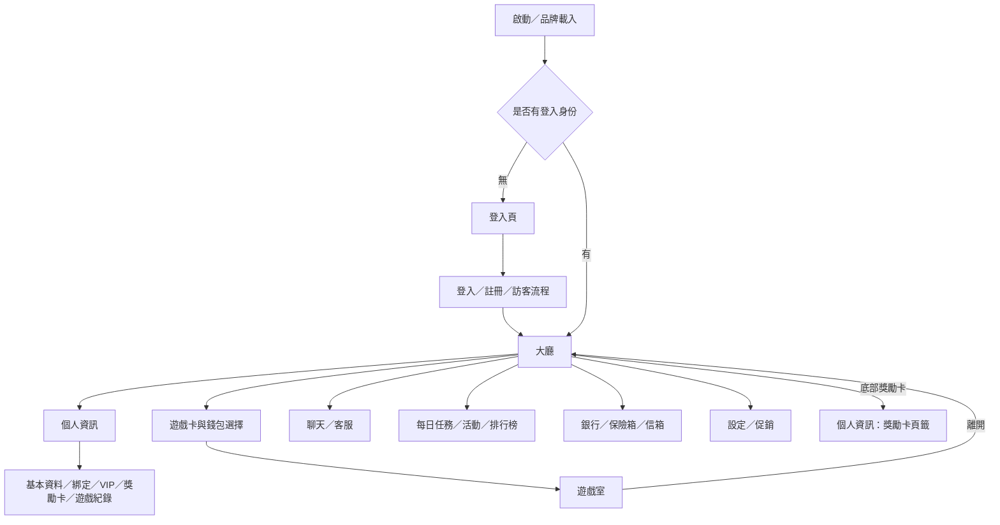

# 巨亨ONLINE 前台介面與使用流程規格書

| 文件項目 | 內容 |
|---|---|
| 文件版本 | v0.4 — 個人資訊、獎勵卡與玩家情境初稿 |
| 建立日期 | 2026-09-08 |
| 原型連結 | [開啟巨亨ONLINE 原型](https://casino-lobby-prototyp-git-29c448-cooperfu615-desingers-projects.vercel.app/#) |
| 讀者 | 美術設計、前端、後端、產品與測試 |
| 本次確認 | 保留第 01～15 章與版本／變更紀錄；以現有功能文件補齊、後續調整修正及開立工作單為用途 |
| 完成範圍 | 第 01～02、06～07 章初稿；第 15 章已補本批相關情境，第 14 章記錄覆蓋；其餘功能章節、完整故事及操作驗收待補 |
| 文件性質 | 前台功能與使用流程；目前不定義 API、資料庫、營運後台操作、遊戲數學或精細視覺數值 |

> 本文是後續撰寫入口。章節架構已確認，不代表章節內全部行為均已確認或實作通過。原有功能規格仍保留效力與適用邊界，尚未被本骨架完整取代。

## 使用與撰寫方式

後續開立工作單時，引用功能章節及適用的 FLOW／US／SC／AC，寫明目前行為、調整目標、影響畫面與驗收條件。完成調整後同步規格正文及變更紀錄，讓文件維持最新狀態。

- 依功能填寫正文，區分已確認需求、原型現況／限制與待確認事項。
- 第 03～12 章使用[功能章節模板](spec-templates/FEATURE_TEMPLATE.md)；章內有多個子功能時各自套用，保留同一章入口。
- 第 15 章使用[玩家故事模板](spec-templates/PLAYER_STORY_TEMPLATE.md)。情境以玩家目標及必要狀態組合為單位，不推測尚未確認的服務能力。
- 第 13 章描述跨介面交接；第 15 章描述「某種狀態的玩家如何完成目標」；第 14 章集中追蹤驗收覆蓋與執行證據。
- 現有來源：[個人資訊規格](PLAYER_PROFILE_SPEC_v1.md)、[銀行優惠碼規格](PROMO_CODE_SPEC.md)、[美術清單](art-design-checklist.md)。細節合併時逐項核對版本與決策，不直接整份複製。
- Markdown 為正文來源；HTML 閱讀版由 `python3 scripts/export_spec_html.py` 同步產生。尚未製作 Word／PDF。

## 目錄與章節狀態

| 章節 | 名稱 | 預計內容 | 正文狀態 |
|---|---|---|---|
| 01 | [文件說明與產品範圍](#ch-01) | 文件目的、適用讀者、原型連結、收錄與未開放功能、原型與正式需求的區分。 | 初稿已撰寫 |
| 02 | [整體介面架構與共用規則](#ch-02) | 介面入口地圖、導航／彈窗、身份、幣別及額度、邀請碼／優惠碼／註冊推廣碼、提示、返回、日期與保存原則。 | 初稿已撰寫 |
| 03 | [啟動、登入與註冊](#ch-03) | 品牌載入、帳號／手機／第三方／訪客登入、建立帳號、忘記密碼、條款與登入後去向。 | 待撰寫 |
| 04 | [遊戲大廳](#ch-04) | 玩家摘要、餘額、分類／供應商／幣別篩選、我的最愛、遊戲列表、底部入口、通知與促銷入口。 | 待撰寫 |
| 05 | [遊戲進入與離開](#ch-05) | 遊戲選擇、錢包及可選條件、載入、遊戲中資訊、活動銀幣使用與轉換結果、離開與返回。 | 待撰寫 |
| 06 | [個人資訊與會員功能](#ch-06) | 共用玩家摘要、邀請碼複製、基本資料、帳號綁定、頭像、VIP 與領獎、遊戲紀錄；獎勵卡入口引用第 07 章。 | 初稿已撰寫 |
| 07 | [獎勵卡](#ch-07) | 列表與額度、來源與狀態、啟用／停用／刪除、合併資格與預覽、計算與來源追蹤、期限、流水轉換與保存。 | 初稿已撰寫 |
| 08 | [銀行、儲值與優惠碼](#ch-08) | 儲值方案、支付確認、優惠碼預覽與領取、獎勵去向、金融紀錄篩選；促銷購買如何接入支付。 | 待撰寫 |
| 09 | [保險箱、贈禮與兌換](#ch-09) | 錢包與保險箱、存入／取出、接收者、贈禮金額、手續費與實收、金銀幣兌換與金融紀錄。 | 待撰寫 |
| 10 | [每日任務、活動與排行榜](#ch-10) | 簽到、補簽、累積進度、里程碑、活動分類／詳情／報名／結果、倍數／贏分／富豪榜。 | 待撰寫 |
| 11 | [聊天、玩家互動與客服](#ch-11) | 公頻、私訊、好友與玩家列表、玩家資訊卡、好友關係、封鎖、贈禮入口、檢舉、客服與自動傳送設定邊界。 | 待撰寫 |
| 12 | [信箱與設定](#ch-12) | 信箱分類、閱讀、附件與刪除；設定另設子功能，含音樂、音效、日夜、語言、推播、黑名單、規章及登出。 | 待撰寫 |
| 13 | [跨介面使用流程](#ch-13) | 以流程節點串接各功能，描述傳入資訊、跨頁更新、返回位置與交接；規則引用功能章節。 | 待撰寫 |
| 14 | [整體驗收與交付對照](#ch-14) | 整體情境覆蓋、跨頁一致性、規格／介面／故事／驗收對照，以及實際驗證結果與證據。 | 已登記第 2 批覆蓋，未執行驗收 |
| 15 | [玩家 User Story 與情境流程](#ch-15) | 從玩家目標出發，設定數種初始狀態，描述主流程、分支、取消／返回與完成結果，供設計、開發、測試共同參考。 | 本批 5 個故事已有情境，部分待後續擴寫 |
| 附錄 | [版本與變更紀錄](#change-log) | 文件變更、調整原因、影響章節與關聯工作單 | 已記錄至 v0.4 |

## 編號與連結原則

- 章節：01～15。介面以產品名稱及所屬章節引用，方便閱讀與開立工作單。
- 流程：FLOW-01 起；玩家目標：US-01 起；其情境：SC-01-01 起（對應 US-01）。
- 驗收：AC-章號-流水號，例如 AC-07-001；既有文件的 AC／Q 編號保留來源，建立對照，不無聲改號。
- 規則以功能章節為主，流程與故事引用同一規則；測試通過與否只依實際證據記錄。

## 01. 文件說明與產品範圍

**狀態：**第 1 批初稿已撰寫，依現行程式與既有確認版文件整理，待閱讀確認；本輪未進行瀏覽器驗證。

### 01.1 文件目的與讀者

本產品已進入收尾階段，本文件用於補齊巨亨ONLINE 前台 APP 的介面功能與使用流程說明，作為後續調整、修正紀錄及開立工作單的共同依據。讀者應能據此理解玩家從何處進入、看到哪些資訊、可進行哪些操作，以及完成或取消後的去向與資料影響。

| 讀者 | 使用方式 |
|---|---|
| 美術設計 | 依功能章節找到畫面、狀態與區塊用途；第 15 章提供玩家情境，後續搭配狀態稿。 |
| 前端 | 依入口、預設頁籤、按鈕條件、提示與返回規則串接互動，核對跨頁資訊一致性。 |
| 後端 | 依身份、資格、幣別、資料需求及操作結果提供功能能力；正式 API 與保存方案另行設計。 |
| 產品與測試 | 依範圍、規則來源、待確認事項、US／SC 與 AC 核對需求及驗收覆蓋。 |

### 01.2 原型參考與文件適用方式

- 原型連結見文件首頁；閱讀介面及操作說明時，可搭配原型查看。
- 畫面定位為 1280 × 720 橫向原型並等比例縮放；不宣稱已完成手機直式或各尺寸的正式版型。
- 本批內容依程式行為與既有文件整理，未另做線上原型操作驗證。後續功能調整應同步更新對應章節，並於版本與變更紀錄留下調整原因及關聯工作單。
- 舊截圖與 Word 不自動視為本版同步輸出。本批沒有產生新截圖、Word、PDF 或正式服務驗證結果。

### 01.3 本版收錄範圍

| 範圍 | 本版收錄內容 | 詳細章節 |
|---|---|---|
| 啟動與身份 | 載入、登入、註冊、訪客、找回密碼與條款介面 | 03 |
| 大廳與遊戲入口 | 資訊列、分類／供應商／幣別／收藏篩選、通知、促銷、選擇錢包、進入與離開遊戲 | 04～05 |
| 個人資訊 | 玩家摘要、邀請碼、基本資料、綁定、VIP、頭像與遊戲紀錄 | 06 |
| 獎勵卡 | 個人資訊內的卡片管理、合併、活動銀額度、流水轉換結果 | 07 |
| 銀行與資產 | 儲值、優惠碼、金融紀錄、保險箱存取、贈禮／轉點與金銀幣兌換 | 08～09 |
| 活動 | 簽到、補簽、里程碑、活動詳情／報名及排行榜 | 10 |
| 社交與客服 | 聊天、玩家卡、好友、封鎖、檢舉與客服，自動傳送設定的現有介面 | 11 |
| 信箱與偏好 | 公告／通知、附件、刪除、音訊／語言／日夜／推播設定、規章與登出 | 12 |
| 跨功能對照 | 交接流程、驗收覆蓋、玩家故事與狀態分支 | 13～15 |

### 01.4 未開放與不納入的能力

| 項目 | 本版處理 |
|---|---|
| 俱樂部 | 大廳未開放，不列入現行玩家流程。 |
| 年齡提示與新手導覽 | 元件未接入目前啟動／大廳流程；不列為登入必經步驟。 |
| 舊交易明細／轉帳彈窗、懸浮小工具 | 未找到現行觸發／掛載；只保留對照，不增加產品入口。 |
| 舊獨立獎勵卡視窗 | 已由個人資訊獎勵卡頁籤承接。 |
| 活動金的遊戲使用、發卡、合併與流水轉換 | 本版只有優惠碼入帳與額度顯示；不據此擴張使用或到期回收規則。 |
| 自動傳送執行、真實推播、完整翻譯 | 只描述目前設定或偏好介面，不宣稱背景排程、系統推播或翻譯已完成。 |
| 真實服務與後台 | 身份驗證、簡訊、OAuth、支付、訊息傳送、遊戲結算、VIP 排程、推薦關係／優惠碼產碼及跨裝置帳務，不以 Mock 成功視為完成。 |
| 技術與精細設計文件 | API、資料庫、遊戲數學、營運後台操作、完整視覺尺寸／色碼另行承接。 |

### 01.5 規則來源與確認方式

| 標示 | 含義 | 本文使用方式 |
|---|---|---|
| 已確認需求 | 使用者明確決策或既有確認版規格中的適用條款 | 保留其範圍與例外，不因重整章節而更改。 |
| 原型現況 | 目前程式可追查的入口與行為 | 作為本版描述基礎；Mock、固定資料與重置方式另外標示。 |
| 待確認 | 正式行為未定義或來源之間不一致 | 僅在相關功能段落註明需要釐清的內容，不另設集中清單，也不填推測答案。 |

本批沒有重新定義各功能的正式金額與權限。第 02 章除明列既有確認事項外，皆屬目前原型的整理。功能細節依各章後續補寫，且需保留以上來源標示。

現有[個人資訊規格](PLAYER_PROFILE_SPEC_v1.md)及[銀行優惠碼規格](PROMO_CODE_SPEC.md)是後續整合依據；本文件不取代 VIP 後台與排程規格。功能名稱或入口調整時，更新所屬章節並留下變更紀錄。

## 02. 整體介面架構與共用規則

**狀態：**第 1 批初稿已撰寫。下列為本版入口、名詞與共用行為，詳細條件由各功能章節補齊。

### 02.1 整體入口地圖

圖中箭頭表示可追查的功能入口；付款與第三方授權仍是原型流程，不能把此圖解讀成正式服務完成證據。

### 02.2 主入口、預設內容與交接

| 來源／操作 | 開啟位置 | 預設內容／帶入資訊 | 關閉或完成後 |
|---|---|---|---|
| 啟動載入完成 | 登入頁或大廳 | 無身份進登入；保存的身份可進大廳 | 不額外插入未接入的年齡提示 |
| 大廳玩家頭像／摘要 | 個人資訊 | 基本資料頁籤，共用摘要持續顯示 | 關閉個人資訊；一般大廳入口回大廳，其他底層已開功能依現況保留 |
| 底部獎勵卡 | 個人資訊的獎勵卡頁籤 | 直接選中獎勵卡頁籤 | 關閉後回大廳 |
| 底部聊天／客服 | 聊天與客服 | 分別開私人聊天／客服 | 關閉整個介面回大廳 |
| 底部每日任務／活動 | 任務與活動 | 分別開每日任務／活動 | 關閉整個介面回大廳 |
| 底部銀行 | 銀行 | 儲值 | 關閉回大廳 |
| 頂部 BUY／錢包餘額 | 銀行 | 使用導航保存的銀行初始頁籤，初值為儲值；不等於一律強制儲值 | 關閉回大廳 |
| 底部保險箱 | 保險箱 | 保險箱頁籤、預設存入模式 | 關閉回大廳 |
| 底部信箱 | 信箱 | 營運公告，預設選擇首筆符合分類的信件 | 關閉回大廳 |
| SALE／大廳促銷圖示 | 促銷彈窗 | 依入口帶入輪播起始索引 | 關閉最上層促銷彈窗 |
| 銀行儲值方案／促銷購買 | 支付彈窗 | 帶入方案內容、App Store 預設通路 | 關閉返回底層銀行或促銷；處理中關閉停用 |
| 銀行優惠 | 銀行優惠頁 | 優惠碼輸入；不是原優惠購買卡片 | 切頁或關閉銀行 |
| 優惠碼預覽成功 | 優惠碼確認領取彈窗 | 代碼、商品、數量、可兌換與使用期限 | 取消不領取；確認後回優惠頁顯示結果 |
| 玩家卡私訊／贈禮／檢舉 | 聊天／客服或保險箱贈禮 | 帶入聊天對象、贈禮接收者 ID，或客服檢舉對象與標題 | 先關閉玩家卡，再開目標功能 |
| 獎勵卡空畫面「前往每日任務」 | 每日任務頁 | 每日任務 | 關閉個人資訊後切換 |
| 活動銀幣 Mock 流水完成 | 活動銀幣轉換結果彈窗 | 轉換與回收結果、銀幣錢包餘額 | 確認／關閉留在原畫面；查看紀錄則離開遊戲並開銀行紀錄 |
| 設定的語言／規章／黑名單 | 語言／規章／黑名單 | 各自功能；規章預設使用者規章 | 先收起設定，關閉彈窗不自動重開設定 |
| 設定登出 | 登入頁 | 清除目前保存的 Mock 身份 | 不宣稱所有共用記憶體資料也已清除，見 02.7 |

### 02.3 身份與頁面層級名詞

| 統一名稱 | 意義與邊界 |
|---|---|
| 未登入 | 目前沒有登入身份，主內容顯示登入頁。 |
| 訪客 | 以訪客登入建立的 Mock 身份，可進大廳；目前為 VIP0、無個人邀請碼、不可兌換優惠碼，也不顯示自動傳送設定入口。其他功能限制須逐項描述，不能概括成訪客只能瀏覽。 |
| 一般會員 | 本版非訪客登入來源的會員身份；目前種子 VIP6 是示範值，不是所有正式會員的初始等級。 |
| 帳號／會員 ID／暱稱 | 帳號是登入識別文字，ID 是玩家識別，暱稱是顯示名稱。三者不得互相替代；傳入玩家對象時保留 ID。 |
| 帳號綁定 | 與目前身份建立手機或 Google 綁定狀態；綁定不自行把訪客升級成一般會員，也不證明身份合併已完成。 |
| 個人資訊 | 查看自己的五頁籤功能；與聊天中查看他人的「玩家資訊卡」分開。 |
| 頁籤 | 同一功能內的內容分類；不是新的登入身份或獨立服務。 |
| 功能介面／彈窗 | 大廳之上的功能內容或確認／選擇視窗；關閉方式依來源與層級描述。 |
| 金融紀錄／遊戲紀錄 | 前者記錄資產相關事件，後者查詢遊戲投注與結果；兩者不是同一列表，也不應假設每個餘額動作目前都會產生金融紀錄。 |
| 目前 VIP／歷史最高 VIP | 生效等級與曾達最高等級分開；歷史最高不得代替目前權益或領獎資格。 |
| 活躍指數／保級活躍天數 | 活躍指數目前固定為 0 的預留欄位；與保級天數不同，不互相映射。 |

### 02.4 幣別與資產位置

| 統一名稱 | 顯示別名 | 資產位置／用途 | 本版區別 |
|---|---|---|---|
| 金幣 | 部分說明稱儲值金幣 | 一般錢包；支援遊戲、保險箱存取與金銀幣兌換 | 是幣別名稱，不由「儲值」字樣推斷每筆金幣都來自付費。 |
| 銀幣 | 儲值銀幣 | 一般錢包；支援遊戲、補簽、兌換與獎勵入帳 | 優惠碼或卡片轉換所得銀幣也進此錢包，不因此增加付費儲值指標。 |
| 銅幣 | 無 | 一般錢包；支援遊戲及指定獎勵 | 不等於活動銀，不納入保險箱金幣。 |
| 活動銀幣 | 活動銀 | 有效獎勵卡的活動額度 | 使用前須啟用；轉換後才進銀幣錢包。 |
| 活動金幣 | 活動金 | 目前優惠碼發放的獨立活動額度 | 僅入帳與顯示，不提供遊戲選擇、卡片或流水轉換。 |
| 保險箱金幣 | 保險箱餘額 | 從錢包存入的金幣，供取出或贈禮 | 與錢包金幣分開計算，不是第六種幣別。 |

| 額度名詞 | 計算／呈現意義 |
|---|---|
| 錢包餘額 | 金、銀、銅分別顯示；不可將三種數字相加作單一可用餘額。 |
| 活動銀幣總額／卡片餘額 | 有效的未啟用、使用中及已停用卡片目前餘額加總；不計已合併來源或已轉換卡。 |
| 目前可用活動銀幣 | 僅有效的使用中卡片餘額；可能低於卡片總額。 |
| 起始餘額紀錄 | 卡片初始金額紀錄，舊規格亦稱卡片總金額；不等於玩家目前可用額度。 |
| 流水／目標流水 | 已累積的有效使用量與達成條件；不等於餘額。原型以 Mock 按鈕完成，不證明逐局累積。 |
| 轉換上限／轉換額度／回收額度 | 上限是可轉換的最大額度；實際轉換取卡片目前餘額與上限的較小值；超出部分為回收額度。 |

頂部顯示金銀銅；個人資訊摘要另顯示活動金、活動銀；獎勵卡概覽再顯示目前可用活動銀。遊戲選擇提供金、銀、活動銀、銅四類，且須同時符合遊戲支援與餘額可用條件。金銀幣兌換、費率、各獎勵數值於後續功能章節說明，本章不新增數值決策。

### 02.5 三種碼的名稱與關係

| 統一名稱 | 所在介面／來源 | 格式與目前用途 | 保存／目前未提供的能力 |
|---|---|---|---|
| 個人邀請碼 | 自己的個人資訊摘要；一般會員 Mock 身份建立時提供 | 8 碼大寫英數，排除 I、O、0、1；顯示與複製 | 隨身份保存，刷新不變；登出再登入可能重建，不保證正式跨玩家唯一性或永久不變。 |
| 銀行優惠碼 | 銀行優惠頁；營運提供的示範碼 | 8 碼英數，忽略前後空白及大小寫；預覽後確認領取指定商品 | 同來源＋帳號同碼一次，本機記憶體保存；不提供後台產碼、推薦關係或跨裝置防重複保證。 |
| 註冊推廣碼 | 註冊表單選填欄位 | 6 或 8 碼大寫英數；畫面提示代理 6 碼／玩家 8 碼 | 目前檢查格式，提交登入未傳遞此欄位以建立關係；不可宣稱已驗證邀請人或發放推薦回饋。 |

**已確認區別：**優惠碼與個人邀請碼是不同用途，不可因皆為八碼而互相使用。註冊推廣碼目前僅檢查格式，尚未建立推薦關係；後續若調整此流程，於註冊與個人資訊章節同步記錄。

### 02.6 共用回饋與返回語意

- 本文件以實際關閉按鈕與操作入口描述返回，不預設手機系統返回鍵或瀏覽器上一頁等同功能返回。
- 聊天、活動、銀行、保險箱、信箱的主關閉回大廳。子頁籤切換不等於主視窗關閉；需要帶入對象的跳轉在 02.2 列明。
- 共用大廳彈窗預設不以背景點擊關閉。活動詳情、獎勵轉換結果等有個別背景關閉行為，依各功能章節說明；不可一律套用。
- 目前未見全域 ESC 關閉彈窗機制。分類側欄具有 ESC 返回子分類／收合行為，不能外推到其他彈窗。
- 支付處理中關閉停用；其他流程的處理中、成功、失敗與可取消時機，由後續章節逐項列出，不強制所有功能使用相同狀態數。
- Toast 是短暫的成功、錯誤或資訊回饋，不是金融紀錄或正式服務憑證；全域 Toast 與聊天局部提示不視為同一保存資料。
- 選取預覽、提交確認與領取成功要分開。優惠碼取消不消耗資格；獎勵卡合併取消不改卡片。已確認的 VIP 領獎按鈕維持其既有狀態，不額外增加等待態。
- 查無資料與操作失敗不同：空清單可提供引導，失敗須保留原因；尚無失敗設計的服務列待確認，不自行發明重試或補償規則。

### 02.7 保存與時間基準

以下描述本機原型，不作為正式後端保存契約。

| 資料 | 切頁／關閉重開 | 重新整理 | 登出／換帳號注意事項 |
|---|---|---|---|
| 身份、個人資料、綁定與邀請碼 | 共用身份保存 | 保留本機身份資料 | 登出清除身份，重新登入建立 Mock 使用者；不是完整帳號資料庫。 |
| 金銀銅、保險箱、VIP 指標／領獎與金融紀錄 | 共用狀態保留 | 回到種子值／紀錄 | 登入重建使用者，金融紀錄未見相同清除邏輯；不得宣稱所有狀態同步隔離。 |
| 任務進度、卡片、合併來源與轉換通知 | 共用狀態保留 | 恢復示範預設 | 目前未依帳號分區。 |
| 優惠碼資格與活動金 | 按登入來源＋帳號保留 | 重置 | 同頁面生命週期可保留不同身份的領取集合，不等於其餘錢包也如此保存。 |
| 聊天訊息與信箱內容／已領附件 | 介面存續時保留，重新掛載會初始化 | 初始化 | 不作為正式聊天歷史或附件防重複機制。 |
| 好友與黑名單 | 共用狀態保留 | 初始化 | 未見帳號分區／登出清除；正式隔離要求待補。 |
| 語言、日夜、音樂與音效偏好、我的最愛 | 保存本機偏好／收藏 | 可還原本機值 | 不是按會員分區；登出不代表偏好清空。 |
| 推播開關 | 設定選單存續期間保留 | 重置 | 重開設定會初始化；沒有真實推播服務。 |

優惠碼兌換期限以含時區的資料判斷，畫面標示台北時間；卡片到期以卡片標示日期的翌日 00:00（瀏覽器當地時區）判斷；任務日曆使用本機日期。這是目前原型的時間處理方式，尚不代表已確認正式統一時區。卡片剩餘時間必須超過 72 小時才可合併是已有確認規則，不因時區議題重開該門檻決策。

### 02.8 可追查依據

產品閱讀可略過本節；設計、開發與測試核對時使用以下來源：

- 啟動與入口：[App](../src/App.tsx)、[大廳](../src/components/layout/LobbyLayout.tsx)、[底部導航](../src/components/layout/BottomNavigation.tsx)、[頂部資訊](../src/components/layout/Header.tsx)、[導航狀態](../src/context/NavigationContext.tsx)。
- 資產與三種碼：[身份與錢包](../src/context/AuthContext.tsx)、[活動額度](../src/hooks/useActivityBalances.ts)、[遊戲錢包](../src/utils/gameWallets.ts)、[邀請碼](../src/utils/invitationCode.ts)、[優惠碼資料](../src/data/promoCodes.ts)、[優惠碼領取](../src/context/PromoCodeContext.tsx)、[註冊提交](../src/components/modals/SignupModal.tsx)。
- 保存與回饋：[獎勵卡](../src/context/RewardCardContext.tsx)、[活動](../src/context/ActivityContext.tsx)、[社交](../src/context/SocialContext.tsx)、[偏好](../src/context/UserPreferencesContext.tsx)、[彈窗外框](../src/components/common/LobbyModalShell.tsx)、[全域彈窗](../src/components/ModalContainer.tsx)、[UI 提示](../src/context/UIContext.tsx)。

## 03. 啟動、登入與註冊

**本章範圍：**品牌載入、帳號／手機／第三方／訪客登入、建立帳號、忘記密碼、條款與登入後去向。

**狀態：**章節骨架已建立，正文待撰寫。

### 03.1 功能目的與範圍

待補。依[功能模板](spec-templates/FEATURE_TEMPLATE.md)填寫。

### 03.2 入口、預設畫面與返回

待補。依[功能模板](spec-templates/FEATURE_TEMPLATE.md)填寫。

### 03.3 畫面區塊與內容

待補。依[功能模板](spec-templates/FEATURE_TEMPLATE.md)填寫。

### 03.4 欄位與顯示規則

待補。依[功能模板](spec-templates/FEATURE_TEMPLATE.md)填寫。

### 03.5 操作與使用流程

待補。依[功能模板](spec-templates/FEATURE_TEMPLATE.md)填寫。

### 03.6 狀態、限制與例外

待補。依[功能模板](spec-templates/FEATURE_TEMPLATE.md)填寫。

### 03.7 資料需求與跨介面影響

待補。依[功能模板](spec-templates/FEATURE_TEMPLATE.md)填寫。

### 03.8 驗收條件

待補。依[功能模板](spec-templates/FEATURE_TEMPLATE.md)填寫。

## 04. 遊戲大廳

**本章範圍：**玩家摘要、餘額、分類／供應商／幣別篩選、我的最愛、遊戲列表、底部入口、通知與促銷入口。

**狀態：**章節骨架已建立，正文待撰寫。

### 04.1 功能目的與範圍

待補。依[功能模板](spec-templates/FEATURE_TEMPLATE.md)填寫。

### 04.2 入口、預設畫面與返回

待補。依[功能模板](spec-templates/FEATURE_TEMPLATE.md)填寫。

### 04.3 畫面區塊與內容

待補。依[功能模板](spec-templates/FEATURE_TEMPLATE.md)填寫。

### 04.4 欄位與顯示規則

待補。依[功能模板](spec-templates/FEATURE_TEMPLATE.md)填寫。

### 04.5 操作與使用流程

待補。依[功能模板](spec-templates/FEATURE_TEMPLATE.md)填寫。

### 04.6 狀態、限制與例外

待補。依[功能模板](spec-templates/FEATURE_TEMPLATE.md)填寫。

### 04.7 資料需求與跨介面影響

待補。依[功能模板](spec-templates/FEATURE_TEMPLATE.md)填寫。

### 04.8 驗收條件

待補。依[功能模板](spec-templates/FEATURE_TEMPLATE.md)填寫。

## 05. 遊戲進入與離開

**本章範圍：**遊戲選擇、錢包及可選條件、載入、遊戲中資訊、活動銀幣使用與轉換結果、離開與返回。

**狀態：**章節骨架已建立，正文待撰寫。

### 05.1 功能目的與範圍

待補。依[功能模板](spec-templates/FEATURE_TEMPLATE.md)填寫。

### 05.2 入口、預設畫面與返回

待補。依[功能模板](spec-templates/FEATURE_TEMPLATE.md)填寫。

### 05.3 畫面區塊與內容

待補。依[功能模板](spec-templates/FEATURE_TEMPLATE.md)填寫。

### 05.4 欄位與顯示規則

待補。依[功能模板](spec-templates/FEATURE_TEMPLATE.md)填寫。

### 05.5 操作與使用流程

待補。依[功能模板](spec-templates/FEATURE_TEMPLATE.md)填寫。

### 05.6 狀態、限制與例外

待補。依[功能模板](spec-templates/FEATURE_TEMPLATE.md)填寫。

### 05.7 資料需求與跨介面影響

待補。依[功能模板](spec-templates/FEATURE_TEMPLATE.md)填寫。

### 05.8 驗收條件

待補。依[功能模板](spec-templates/FEATURE_TEMPLATE.md)填寫。

## 06. 個人資訊與會員功能

**本章範圍：**自己的玩家摘要、邀請碼、基本資料、帳號綁定、頭像、VIP 權益與領獎，以及遊戲紀錄。獎勵卡管理統一引用[第 07 章](#ch-07)；查看其他玩家的資訊卡屬第 11 章。

**狀態：**第 2 批初稿。本章以既有[個人資訊規格](PLAYER_PROFILE_SPEC_v1.md)及現行操作邏輯核對整理；驗收條件已撰寫，本批未執行瀏覽器或正式服務驗收。

### 06.1 功能目的與範圍

玩家在同一個「個人資訊」視窗查看身份、完善資料、確認綁定、理解 VIP 權益並查詢遊戲紀錄。美術、前後端與測試可依本章的小節及驗收編號建立調整工作單；單純編修文件不改變既有功能規則。

個人資訊有五個頁籤，依序為「基本資料」「帳號綁定」「VIP 等級」「獎勵卡」「遊戲紀錄」。一般會員與訪客均可開啟；未登入時不顯示。訪客綁定手機或 Google 不會自行改變身份，也不因綁定而取得邀請碼。

### 06.2 入口、預設畫面與返回

| 入口／操作 | 預設內容或帶入資料 | 返回／保留方式 |
|---|---|---|
| 大廳頂部玩家摘要 | 開啟個人資訊，預設基本資料 | 主關閉收起個人資訊；下層若已有功能介面，依原入口保留 |
| 底部獎勵卡 | 開啟同一個個人資訊視窗，直接選中獎勵卡 | 主關閉回大廳 |
| 切換五個頁籤 | 左側摘要持續顯示，右側更換內容 | 已完成保存／領取的共用資料保留；表單草稿、查詢結果及合併選取不跨頁籤保留 |
| 摘要的更換頭像 | 疊加頭像選擇，帶入目前頭像 | 儲存或關閉只結束頭像視窗，回原頁籤 |
| 基本資料的一次性資料確認 | 列出本次新填的生日及／或 Email | 「返回修改」或關閉確認層保留表單草稿；確認保存後回基本資料 |
| VIP機制說明 | 疊加說明視窗，預設等級總覽 | 關閉回 VIP 等級，不關閉個人資訊 |

主視窗不以背景點擊關閉，亦未提供全域 ESC 關閉規則。未送出表單時切頁／關閉不另跳出捨棄確認；重開依已保存資料初始化。儲存、驗證中的離頁不等於取消已送出的操作，原型尚未提供這些延遲操作的取消流程。

### 06.3 畫面區塊與內容

| 區塊 | 顯示資訊及操作用途 |
|---|---|
| 標頭與頁籤 | 個人資訊標題、主關閉，以及五個文字頁籤 |
| 共用玩家摘要 | 頭像與更換入口、暱稱、目前 VIP、帳號、會員 ID、邀請碼與複製；一般金銀銅餘額，另列活動金／活動銀 |
| 基本資料 | 身份唯讀欄位、可編輯資料、欄位錯誤、一次性資料提示、儲存按鈕 |
| 帳號綁定 | 手機號碼與 Google 兩張卡，各自呈現未綁定、操作過程及已綁定結果 |
| VIP 等級 | 目前與歷史最高 VIP、歷史儲值／投注、活躍指數；等級權益、下一級條件、保級狀態及機制說明 |
| 遊戲紀錄 | 日期區間、查詢、查詢前／查無資料提示、結果表格、上一頁／下一頁 |

金銀銅餘額使用緊湊排列，以圖示顏色區分並保留幣名提示；活動金、活動銀在下方同列顯示。所有餘額定義引用 02.4；卡片總額不可當作目前可用活動銀幣。

### 06.4 欄位與顯示規則

#### 06.4.1 身份、邀請碼與基本資料

| 欄位 | 可編輯／必填 | 格式及限制 | 初始／保存後呈現 |
|---|---|---|---|
| 帳號、會員 ID | 唯讀 | 顯示目前身份資料，不在此更改 | 摘要及基本資料使用同一身份 |
| 暱稱 | 可編輯、必填 | 去除前後空白後不可為空；最多 20 個字元 | 帶入已保存暱稱；儲存後同步摘要與大廳 |
| 生日 | 選填、首次非空保存後鎖定 | 日期選擇，1900/01/01 起，最晚為今天往前 18 年；玩家須年滿 18 歲 | 未填時可輸入；保存後顯示鎖定，不提供再次編輯 |
| 電子郵件（Email） | 選填、首次非空保存後鎖定 | 去除前後空白；非空須符合電子郵件格式 | 未填時可輸入；保存後鎖定；沒有寄送驗證信流程 |
| 手機號碼 | 基本資料內唯讀 | 由帳號綁定頁更新 | 尚未有號碼時顯示「尚未綁定」 |
| 個人簡介 | 可編輯、選填 | 最多 120 個字元，顯示字數；超過限制時不可保存；保存去除前後空白 | 帶入已保存內容，可重複修改 |
| 個人邀請碼 | 唯讀 | 一般會員 8 碼大寫英數，排除 I、O、0、1；不提供更換或重產按鈕 | 訪客顯示「完成註冊後取得」，沒有複製鈕 |

畫面星號代表「可編輯欄位」，不表示所有星號欄位都必填。生日及 Email 尚未填入時可以留空保存其他資料，留空不會將該欄位鎖定。

生日或 Email 首次保存非空值時，一次性確認層只列出本次新設定的項目。確認前不更新身份；返回修改不鎖定欄位。已鎖定資料需要更正時，原型僅顯示由客服協助的說明，未實作更正申請。

複製邀請碼只複製畫面上的 8 碼；成功顯示「邀請碼已複製」，失敗顯示「複製失敗，請長按或選取邀請碼複製」。文字可手動選取；複製不建立推薦關係，也不發放獎勵。三種碼的用途引用 02.5。

#### 06.4.2 手機與 Google 綁定

| 項目 | 欄位與操作規則 | 成功後結果 |
|---|---|---|
| 手機輸入 | 只收數字、最多 10 碼；須為 09 開頭的 10 碼號碼 | 發送後進驗證碼步驟，顯示接收號碼 |
| 驗證碼 | 只收數字、最多 6 碼；未滿 6 碼或驗證中時確認綁定停用；原型固定以 `123456` 驗證 | 正確時模擬驗證後更新號碼及已綁定狀態 |
| 重發 | 發送後倒數 60 秒，倒數中不可重發；重發清空驗證碼並重新倒數 | 留在驗證碼步驟；倒數是重發限制，不代表已實作驗證碼有效期 |
| 修改手機 | 驗證步驟可返回修改手機號碼 | 尚未成功綁定，不變更已保存身份 |
| Google | 點擊綁定後呈現連線中；原型以延遲模擬完成 | 只改 Google 綁定狀態，不自動填 Email 或手機 |
| 已綁定 | 呈現綁定摘要及已綁定狀態 | 無解除、更換綁定或重複綁定入口 |

格式錯誤及驗證碼錯誤留在原步驟顯示原因，可修正後重試。原型不傳送簡訊、不連線 Google OAuth；正式的授權取消、服務錯誤與驗證碼有效期尚未在此流程定義。Google 綁定與 Email 一次設定是兩件事，不能互相替代。

#### 06.4.3 頭像選擇

預設選中目前頭像。「頭像」頁籤顯示 20 個選項，1～10 可選、11～20 固定鎖定；鎖定項目的 VIP 或活動提示為展示，不會依目前 VIP 動態解鎖。選取先改暫存選擇，與目前頭像不同時才可儲存；儲存成功後更新摘要及大廳頭像並關閉子視窗。未儲存直接關閉則維持原頭像。「頭像框」頁籤顯示即將開放，不提供套用功能。

#### 06.4.4 VIP 資訊、條件與權益

| 區塊 | 顯示與判讀規則 |
|---|---|
| 目前等級 | 顯示 VIP0～VIP15 與等級名稱；權益、下一級及保級以目前生效等級為準 |
| 歷史最高 | 僅供歷程顯示，不能代替目前等級或領獎資格 |
| 歷史累積儲值／投注 | 分開顯示；升級進度使用歷史儲值與「本月有效投注」，不以歷史投注替代本月投注 |
| 活躍指數 | 固定顯示 0，沒有單位與計算；不等於保級使用的活躍天數 |
| 下一級條件 | 顯示下一等級、兩項進度、差額及資料要求；已設定條件須全部達成 |
| VIP2 條件未設定 | 目前為 VIP1 時，下一級顯示「條件待設定」，暫不計算進度；不把空值當作零門檻 |
| 最高等級 | VIP15 顯示「已達目前最高等級」，不顯示下一級進度 |
| 保級狀態 | 優先顯示「本月升級保護中」；否則依條件顯示「目前已達標」「尚未達標」或「無條件保級」 |
| 保級明細 | 保級開啟時分列本月儲值、本月投注、活躍天數；未啟用的條件不當作必須補齊的門檻 |
| 本級獎勵 | 有獎勵時只有「可領取」「已領取」；VIP0 顯示停用的「無可領取獎勵」 |

以下為本版介面配置，與既有個人資訊規格及原型一致，供日後調整時對照。所有等級目前顯示「無額外要求」，贈禮手續費均為 5%；此表不將示範配置提升為已核准的正式營運參數。VIP2 升級門檻仍未設定，費率如有調整需與贈禮功能同步。

| 等級 | 名稱 | 升級條件 | 保級條件 | 升級獎勵 | 贈禮手續費 |
|---|---|---|---|---|---|
| VIP0 | 鐵牌 | 新註冊 | 無條件保級 | 無 | 5% |
| VIP1 | 銅牌 | 歷史儲值 1,000；本月投注 10,000 | 無條件保級 | 銅幣 1,000 | 5% |
| VIP2 | 銀牌 | 條件待設定 | 無條件保級 | 銅幣 5,000 | 5% |
| VIP3 | 金牌 | 歷史儲值 5,000；本月投注 50,000 | 月儲值 2,500；月投注 25,000；活躍 8 天 | 銀幣 100 | 5% |
| VIP4 | 白金 | 歷史儲值 10,000；本月投注 100,000 | 月儲值 5,000；月投注 50,000；活躍 12 天 | 銀幣 250 | 5% |
| VIP5 | 琥珀 | 歷史儲值 20,000；本月投注 200,000 | 月儲值 10,000；月投注 100,000；活躍 16 天 | 銀幣 500 | 5% |
| VIP6 | 翡翠 | 歷史儲值 35,000；本月投注 350,000 | 月儲值 18,000；月投注 180,000；活躍 16 天 | 銀幣 1,000 | 5% |
| VIP7 | 藍寶石 | 歷史儲值 55,000；本月投注 550,000 | 月儲值 28,000；月投注 280,000；活躍 20 天 | 銀幣 1,800 | 5% |
| VIP8 | 紅寶石 | 歷史儲值 80,000；本月投注 800,000 | 月儲值 40,000；月投注 400,000；活躍 20 天 | 銀幣 2,800 | 5% |
| VIP9 | 鑽石 | 歷史儲值 100,000；本月投注 1,000,000 | 月儲值 50,000；月投注 500,000；活躍 24 天 | 銀幣 4,000 | 5% |
| VIP10 | 黑耀 | 歷史儲值 150,000；本月投注 2,000,000 | 月儲值 75,000；月投注 1,000,000；活躍 24 天 | 銀幣 6,000 | 5% |
| VIP11 | 宗師 | 歷史儲值 250,000；本月投注 3,500,000 | 月儲值 120,000；月投注 1,750,000；活躍 25 天 | 銀幣 10,000 | 5% |
| VIP12 | 王者 | 歷史儲值 400,000；本月投注 6,000,000 | 月儲值 200,000；月投注 3,000,000；活躍 25 天 | 銀幣 18,000 | 5% |
| VIP13 | 傳奇 | 歷史儲值 650,000；本月投注 10,000,000 | 月儲值 320,000；月投注 5,000,000；活躍 26 天 | 銀幣 30,000 | 5% |
| VIP14 | 神話 | 歷史儲值 1,000,000；本月投注 16,000,000 | 月儲值 500,000；月投注 8,000,000；活躍 26 天 | 銀幣 50,000 | 5% |
| VIP15 | 至尊 | 歷史儲值 1,500,000；本月投注 25,000,000 | 月儲值 750,000；月投注 12,500,000；活躍 28 天 | 銀幣 88,888 | 5% |

機制說明呈現既有規則：每日 00:00 審核升級，已設定條件須全達成；同時符合多級時升到最高符合級。每月 1 日結算保級，先判斷升級，未升級才判斷保級；未升級且不符保級時下降一級。本月曾升級則受保護，不因保級不足降級。這些為前台規則說明，原型沒有實際排程引擎，畫面進度達標不會立即改 VIP。前台不提供返水或連續降級次數。

「VIP機制說明」每次開啟預設等級總覽，依序列等級、升級條件、保級條件、獎勵及手續費；目前等級突出顯示並定位到該列。切到規則說明可閱讀升級、保級、降級、領獎四段內容；切回總覽再定位目前等級。捲動內容時頁籤與關閉仍可操作。

#### 06.4.5 遊戲紀錄

| 項目 | 規則 |
|---|---|
| 日期區間 | 預設開始為今天往前 30 天、結束為今天；日期選擇器範圍為這兩日之間，含端點 |
| 查詢時機 | 進頁不自動查詢，顯示「請選擇日期區間後查詢」；按查詢才更新結果 |
| 不合法區間 | 缺任一日期時查詢停用；開始晚於結束時停用並顯示錯誤 |
| 結果 | 編號、遊戲名稱、投注額、贏分、該筆錢包餘額；金額以千分位顯示，正贏分加 +，正負值區分呈現 |
| 排序與分頁 | 依紀錄時間由新到舊；每頁 10 筆，編號跨頁連續；超過一頁才顯示分頁，首末頁相應按鈕停用 |
| 改變日期 | 不立即替換舊結果；再次按查詢更新並回第 1 頁 |
| 無結果 | 查詢後無符合資料時顯示「查無紀錄」，與尚未查詢不同 |
| 切頁與重開 | 離開遊戲紀錄頁籤後重進，重新建立查詢初始狀態 |

目前使用本機產生的 100 筆 Mock 紀錄；時間供篩選及排序，不顯示在結果欄位。紀錄中的錢包餘額不是目前玩家即時餘額，也未標明各筆幣別，不能據此推定屬於特定錢包或遊戲室真實結算。原型未提供紀錄詳情、匯出或服務載入失敗流程。

### 06.5 操作與使用流程

| 流程 | 玩家操作 | 系統回饋與資料變化 | 完成位置 |
|---|---|---|---|
| 保存基本資料 | 開基本資料 → 修改 → 儲存；新填生日／Email 時再確認 | 檢核失敗不保存；確認後顯示儲存中，完成提示「基本資料已更新」並同步共用身份 | 基本資料；一次性非空欄位鎖定 |
| 手機綁定 | 帳號綁定 → 輸入手機 → 發送 → 輸入碼 → 驗證 | 格式／驗證錯誤可修正；成功顯示已綁定，基本資料手機欄同步 | 帳號綁定 |
| Google 綁定 | 帳號綁定 → 點 Google 綁定 | 連線中後改已綁定，Email 不變 | 帳號綁定 |
| 頭像 | 摘要更換 → 選可用頭像 → 儲存 | 未確認前只改選取；確認後同步頭像並提示 | 原個人資訊頁籤 |
| 邀請碼 | 摘要 → 複製 | 只寫入剪貼簿，成功／失敗各有回饋 | 原頁籤 |
| VIP 領獎 | VIP 等級 → 確認本級商品 → 點可領取 | 驗證本級與未領資格，對應錢包增加，產生一筆免費獎勵金融紀錄；Toast 含級別、幣別、數量 | 留 VIP，按鈕直接變已領取 |
| 遊戲紀錄 | 選起訖日 → 查詢 → 翻頁 | 只查詢展示資料，不變更錢包 | 遊戲紀錄 |

VIP 只領目前生效級，每級一次，不提供歷史未領清單或跨級補領；重新升回已領等級也不能重領。原型同步完成領取，不新增「領取中」按鈕狀態。領獎紀錄來源為「VIP {等級} 升級獎勵」，可從銀行紀錄查看；領取本身不自動跳銀行。

### 06.6 狀態、限制與例外

| 情境 | 處理及影響 |
|---|---|
| 一般會員／訪客 | 一般會員初始 VIP6、訪客 VIP0 是 Mock 展示值；不可寫成正式帳號必定從這些等級開始 |
| 已填生日／Email | 保存與重開均顯示鎖定；其他可編輯欄位仍可保存 |
| 未保存草稿離頁 | 重進以保存值重建，不新增離頁確認 |
| VIP 重複領取 | 已領按鈕停用；同一原型身份生命週期內快速重複操作不再增加餘額或紀錄 |
| 已達升級條件 | 只反映進度，不能把查看或儲存資料當作立即升級事件 |
| 無獎勵／條件待設定 | 無獎勵不可領；未設定門檻不顯示誤導性的 100% 達成 |
| 缺正式服務狀態 | 保留該功能的現況說明；日後補簡訊、OAuth、VIP 排程或紀錄服務時，由工作單寫清新增狀態及驗收 |

### 06.7 資料需求與跨介面影響

| 取得／送出內容 | 更新與保存需求 | 不應混用的資料 |
|---|---|---|
| 身份、暱稱、頭像、邀請碼與個人資料 | 取得已保存值；送出可編輯內容並回傳鎖定狀態；摘要、大廳及基本資料一致 | 帳號、ID、暱稱及邀請碼互相獨立 |
| 手機號碼、驗證碼、Google 授權結果 | 成功回傳綁定狀態與手機；原型保存已完成的身份與綁定結果 | Google 綁定不等於 Email 設定或訪客升級 |
| VIP 指標、各級規則、已領等級集合 | 顯示目前狀態；領取回傳對應錢包餘額與一筆金融紀錄 | 歷史最高不代替目前級；獎勵不增加付費儲值或投注指標 |
| 遊戲紀錄日期及頁碼 | 取得符合區間的資料、數量及排序資訊 | 遊戲紀錄不取代金融紀錄，也不直接改餘額 |
| 活動額度 | 摘要與獎勵卡概覽使用同一計算結果 | 活動金、活動銀、金銀銅各自獨立 |

保存方式引用 02.7：個人資料、頭像、邀請碼及已完成綁定會隨本機身份保存；重新整理保留。主動登出清除該身份。VIP 領獎狀態、錢包及新增金融紀錄在重新整理後重置；卡片有自己的生命週期，不能由身份保存推論卡片也已持久化。

### 06.8 驗收條件

以下為可供工作單引用的驗收條件，並非本批已執行結果。舊規格的 AC 編號仍保留於原文件，本章使用 AC-06 編號。

| AC 編號 | 前置狀態／操作 | 可觀察結果 | 關聯故事 |
|---|---|---|---|
| AC-06-001 | 從頂部摘要與底部獎勵卡分別開啟 | 同一個人資訊外框，分別預設基本資料與獎勵卡；五頁籤順序正確 | US-03、US-05 |
| AC-06-002 | 修改暱稱、簡介並保存；再切頁及重開 | 成功後摘要及大廳同步；空暱稱、超長簡介不保存且顯示原因 | US-03 |
| AC-06-003 | 首次填生日／Email，先返回修改再確認保存 | 返回時身份不變且草稿保留；確認才保存及鎖定；留空欄位不鎖定 | US-03 |
| AC-06-004 | 輸入格式錯誤 Email 或不合年齡／日期範圍的生日 | 顯示欄位錯誤，不進入成功保存；修正後可繼續 | US-03 |
| AC-06-005 | 未綁定手機，依序試錯誤號碼、錯誤碼及正確 Mock 碼 | 錯誤不綁定；正確後綁定頁與基本資料號碼一致；重發倒數 60 秒內停用 | US-03 |
| AC-06-006 | 綁定 Google | 連線中後已綁定；不修改 Email、手機或訪客身份；不顯示解除入口 | US-03 |
| AC-06-007 | 頭像先取消、再選不同可用項儲存 | 取消不變；確認後摘要及大廳同步；11～20 固定不可選，頭像框未開放 | US-03 |
| AC-06-008 | 一般會員複製邀請碼，另以訪客開啟 | 複製內容恰為畫面 8 碼；失敗有手動複製提示；訪客無複製鈕 | US-03 |
| AC-06-009 | 目前 VIP6、歷史最高 VIP8 的測試身份查看權益 | 依 VIP6 顯示目前權益與下一級，VIP8 僅在歷史最高；活躍指數固定 0 | US-04 |
| AC-06-010 | VIP1／VIP15 測試身份查看升級區 | 分別為條件待設定／最高級；不把空門檻當已達標 | US-04 |
| AC-06-011 | 未領 VIP6 點可領取並重複操作 | 銀幣僅加 1,000、一筆免費獎勵紀錄、提示及已領取；其他錢包、活動額度、VIP 指標不變 | US-04 |
| AC-06-012 | VIP0 或本級已領 | 對應無可領取獎勵／已領取且停用，不增加餘額與紀錄 | US-04 |
| AC-06-013 | 開機制說明、切換頁籤及關閉；查看各保級狀態 | 總覽定位目前級；關閉只退該層；保護、達標、未達標、無條件呈現符合規則 | US-04 |
| AC-06-014 | 遊戲紀錄選區間、查詢、翻頁、改區間再查詢 | 查詢前不顯示結果；每頁 10 筆、編號連續；重查回第 1 頁，日期修改不立即取代舊結果 | US-13 |
| AC-06-015 | 缺日期、倒置日期或無符合紀錄 | 不合法時查詢停用；合法且無結果才顯示查無紀錄 | US-13 |
| AC-06-016 | 保存資料／綁定且完成 VIP 領取後重新整理 | 個人資料及綁定保留，VIP 領取與金融 Mock 重置；未將兩者描述成同一保存契約 | US-03、US-04 |

## 07. 獎勵卡

**本章範圍：**卡片清單、額度、來源、啟用／停用／刪除、合併、期限、流水轉換與保存。領卡入口銜接每日任務及銀行優惠碼；遊戲啟動細節於第 05 章補寫。

**狀態：**第 2 批初稿。合併資格與計算沿用已確認規則；數值範例標明原型或測試資料，不新增活動金使用規則。驗收條件已撰寫，本批未執行瀏覽器或正式帳務驗收。

### 07.1 功能目的與範圍

玩家可檢視活動銀幣獎勵卡，選擇使用中的卡片，或整理符合條件的多張卡片。獎勵卡承載活動銀幣額度；領卡、啟用、停用與合併均不直接增加一般銀幣錢包，流水完成轉換後才入帳。

本版只有活動銀幣卡。頁面雖另顯示活動金幣額度，但活動金幣目前只有優惠碼入帳及顯示，沒有對應卡片、合併、遊戲使用或流水轉換。

### 07.2 入口、預設畫面與返回

| 入口／操作 | 預設內容 | 返回／交接 |
|---|---|---|
| 底部獎勵卡 | 個人資訊直接開獎勵卡頁籤，顯示概覽及列表 | 主關閉回大廳 |
| 個人資訊切至獎勵卡 | 同一列表與共用摘要 | 可切其他頁籤；主關閉依個人資訊入口返回 |
| 空清單「前往每日任務」 | 關閉個人資訊，開每日任務 | 領卡後玩家自行由底部獎勵卡返回查看，不自動跳回 |
| 每日任務／優惠碼領卡 | 成功後在共用列表新增未啟用卡，保留來源 | 留原領取介面；進獎勵卡即可看到 |
| 規則說明 | 本頁子視窗顯示使用、轉換及合併規則 | 「我知道了」返回本頁，不改卡片 |
| 刪除確認 | 顯示刪除不可恢復、不能恢復原領取資格的提醒 | 取消回列表；確認刪除後留列表 |
| 合併 | 同頁切換合併模式，顯示選框及固定下方預覽／操作區 | 取消／切頁／主關閉清除選取，不改原卡；成功留本頁並捲到新卡 |

### 07.3 畫面區塊與內容

| 區塊 | 資訊與操作 |
|---|---|
| 頁首 | 獎勵卡標題、規則說明、合併入口；符合資格的卡片少於兩張時合併入口停用 |
| 額度概覽 | 活動金幣、活動銀幣總額、目前可用活動銀幣；與左側玩家摘要的活動額度一致 |
| 卡片清單 | 兩張一列，奇數張最後一張靠左，清單內捲動；一般領卡加入尾端，合併新卡放最上方 |
| 單張卡片 | 名稱、來源、狀態、目前餘額、起始餘額紀錄、轉換上限、已達成／目標流水、進度與期限 |
| 轉換後卡片 | 保留已轉換數量、系統回收數量及轉換時間，供查看結果 |
| 空清單 | 「目前沒有獎勵卡」、取得方式及前往每日任務 |
| 合併模式 | 合格卡可勾選，不合格卡說明原因；下方固定顯示選取張數、預覽、取消與確認合併 |

已合併的來源卡退出可見清單，但保留來源關係；已轉換及過期卡仍可顯示，因此「沒有可用卡」不一定等於空清單。合併來源只顯示涵蓋的原始張數，未提供另開來源明細的操作。

### 07.4 欄位、額度與有效期限

| 欄位 | 意義與顯示規則 |
|---|---|
| 名稱／來源 | 任務卡顯示任務節點，優惠碼卡顯示來源文字；合併卡名為「活動銀幣合併卡」，來源顯示由幾張原始卡合併 |
| 目前餘額 | 目前仍在卡上的活動銀幣，可與起始值不同 |
| 起始餘額紀錄 | 初次取得的卡片金額；舊文件稱卡片總金額。合併時加總來源起始值，不以目前餘額覆蓋 |
| 流水量 | 已達成流水／目標流水；進度條依兩者比例，最高顯示 100%，目標為 0 時顯示 0% |
| 轉換上限 | 流水完成時最多轉入一般銀幣的數量，不是保證可取得該數量 |
| 有效期限 | 顯示到期日期；標示當日有效，瀏覽器當地時區翌日 00:00 起不可啟用、合併或轉換 |
| 轉換結果 | 已轉換額度、回收額度、時間；轉換後目前餘額為 0 |
| 額度總額 | 活動銀加總有效的未啟用、使用中、已停用卡片目前餘額；排除過期、已轉換與已合併來源 |
| 目前可用 | 僅有效使用中卡片的目前餘額；總額大於 0 但未啟用任何卡時，可用仍為 0 |

一般任務與優惠碼新卡為未啟用，起始及目前餘額依發放內容，流水與期限依該來源配置。本版任務展示資料如下；目前預設累積 20 天，因此三節點都可領，與日曆已簽日期數分開。重新整理恢復此展示狀態，不代表正式玩家固定取得這些資格。

| 原型來源 | 起始／目前餘額 | 已達成／目標流水 | 轉換上限 | 到期日期 |
|---|---|---|---|---|
| 每日任務第 10 天 | 10,000／10,000 活動銀幣 | 0／100,000 | 10,000 | 2026/12/31 |
| 每日任務第 15 天 | 10,000／10,000 活動銀幣 | 0／100,000 | 10,000 | 2026/12/31 |
| 每日任務第 20 天 | 5,000／5,000 活動銀幣 | 0／100,000 | 10,000 | 2026/12/31 |

第 10 天數值沿用既有原型暫借設定，不能直接當作正式營運金額。優惠碼卡依各碼預覽內容，不一律套用此表。第 5、7、25、30 天為無卡片額度的里程碑；完整任務規則後續集中在第 10 章。

### 07.5 操作與使用流程

#### 07.5.1 領取、啟用、停用與刪除

| 操作 | 前提／步驟 | 結果與跨頁影響 |
|---|---|---|
| 任務領卡 | 已達節點且未領 → 點該獎勵 | 新增未啟用卡、節點變已領；活動銀總額增加，一般金銀銅不變 |
| 優惠碼領卡 | 有效的活動銀卡商品 → 預覽 → 確認領取 | 新增未啟用卡並標記該碼已領；優惠碼發放紀錄依第 08 章，不視為銀幣轉換入帳 |
| 啟用 | 未啟用／已停用且未過期 → 啟用 | 本卡變使用中；若已有另一張使用中卡，原卡自動停用；同時最多一張使用中 |
| 停用 | 使用中 → 停用 | 卡片改已停用，可用額度歸零；仍有效時總額保留，已累積流水不歸零 |
| 刪除 | 未啟用／已停用 → 刪除 → 確認 | 卡片移出清單，額度隨之更新；一般錢包不變，原任務與優惠碼資格不恢復 |
| 取消刪除 | 刪除確認 → 取消 | 卡片與所有數值不變，返回列表 |

啟用及停用直接執行並顯示成功提示，不額外插入確認步驟。若操作時卡片不存在、狀態或期限不允許，顯示「操作失敗，請確認卡片狀態與有效期限」，不更動卡片。

#### 07.5.2 合併資格與流程

1. 至少有兩張合格卡，合併入口才可操作。合格卡須為未啟用或已停用，且每張距離實際到期時間**超過 72 小時**。
2. 張數至少兩張、無上限；使用中卡須先退出合併模式並停用，再進入選取。剩餘時間小於或等於 72 小時，包括恰好 72 小時，均不可合併；這個限制不阻擋未過期卡片啟用。
3. 進合併模式後勾選卡片。選取未滿兩張或任何選中卡已不符資格時，不顯示有效結果預覽，確認合併停用。
4. 預覽列出張數、目前餘額、起始餘額紀錄、轉換上限、流水及最早到期日。確認前不扣卡、不改錢包。
5. 確認時再次檢查每張卡的狀態與期限，一次將來源卡標為已合併並建立新卡。新卡為未啟用，置於最上方，回到列表頂部並提示「已建立活動銀幣合併卡，請啟用後使用」。
6. 若確認時資格已變，原卡不變，清除選取並提示「卡片狀態或剩餘期限已變更，請重新選取」。玩家可重選或取消。
7. 取消只退出模式、清除選取；合併完成後沒有拆回原卡的操作。來源卡不能再次獨立使用，合併卡符合資格時可與其他卡再合併。

#### 07.5.3 合併計算與範例

| 合併欄位 | 計算方式 |
|---|---|
| 起始餘額紀錄 | 所選卡片起始值直接加總 |
| 目前餘額 | 所選卡片目前值直接加總 |
| 目標流水 | 所選卡片目標直接加總 |
| 已達成流水 | 所選卡片已達成值直接加總，不清零 |
| 轉換上限 | 所選卡片上限直接加總 |
| 有效期限 | 所選卡片中最早的到期日；不展延短期限卡 |
| 來源張數 | 累計原始來源張數；合併卡再參與時須包含先前來源 |

五項原始數值各自直接加總，**不依流水倍數重新換算**。合併後的流水與起始餘額比例可能與單一卡片不同，這是直接加總的結果。合併本身不改一般金銀銅、不增加付費儲值、不產生銀幣入帳或銀行轉換紀錄。

以下為計算驗收用資料，假設兩卡均未啟用、都距到期超過 72 小時：

| 項目 | 卡 A | 卡 B | 合併結果 |
|---|---|---|---|
| 起始餘額紀錄 | 10,000 | 5,000 | 15,000 |
| 目前餘額 | 8,000 | 4,000 | 12,000 |
| 已達成流水 | 20,000 | 30,000 | 50,000 |
| 目標流水 | 100,000 | 100,000 | 200,000 |
| 轉換上限 | 10,000 | 10,000 | 20,000 |
| 到期 | 2026/12/31 | 2026/12/20 | 2026/12/20 |
| 狀態 | 未啟用 | 已停用 | 未啟用，顯示由 2 張合併 |

此例目前餘額為 12,000，而起始紀錄為 15,000，兩者都須保留；進度為 50,000 ÷ 200,000＝25%。具非零流水或變動餘額的測試卡需另行準備，原型目前沒有逐局累積介面可自然建立這組資料。

#### 07.5.4 遊戲使用與流水轉換

玩家先啟用卡，再於支援活動銀幣且有可用餘額的遊戲選擇活動銀幣進入。未啟用時即使總額為正，仍不能以活動銀幣進入；遊戲不支援該幣別時也不可選。

原型遊戲室提供 Mock 完成流水操作，會一次將已達成流水補到目標並執行轉換；它不是逐局下注、流水累積或正式結算的證據。

- 轉換額度＝目前餘額與轉換上限的較小值；系統回收＝目前餘額減轉換額度。原型以非負整數計算，有小數先無條件捨去；不把此數值處理自動當成正式帳務精度決策。
- 只接受有效、使用中的卡片，且轉換額度須大於 0。不能轉換未啟用、已停用、過期、已合併或已轉換卡。
- 成功時卡片變已轉換、目前餘額歸零、保留轉換／回收／時間；一般銀幣增加轉換額度，新增一筆「獎勵卡流水完成・卡片名稱」紀錄。
- 顯示轉換結果視窗：轉換前額度、轉入銀幣、系統回收與銀幣錢包結果。確認／關閉只標記已讀並留在原畫面；「查看紀錄」結束遊戲並進銀行紀錄。
- 同一卡片不能重複入帳。查看或關閉結果不再次發獎；合併來源也不能另行轉換。

例如目前餘額 12,000、上限 10,000，轉入銀幣 10,000、回收 2,000；餘額 5,000、上限 10,000，則轉入 5,000、回收 0。這兩例用來說明公式，非新增發獎配置。

### 07.6 狀態、限制與例外

| 狀態 | 啟用 | 停用 | 刪除 | 合併／轉換 |
|---|---|---|---|---|
| 未啟用、未過期 | 可 | 不可 | 可，需確認 | 超過 72 小時可合併；未啟用不可轉換 |
| 使用中、未過期 | 不可重啟本卡 | 可 | 不可 | 先停用才能合併；可由遊戲 Mock 完成轉換 |
| 已停用、未過期 | 可 | 不可 | 可，需確認 | 超過 72 小時可合併；不可直接轉換 |
| 剩餘時間 ≤72 小時但未過期 | 依未啟用／停用狀態可啟用 | 使用中可停用 | 依原狀態 | 不可合併；使用中仍可轉換 |
| 已過期 | 不可 | 若原為使用中仍可停用 | 原為未啟用／已停用可刪除 | 不可合併或轉換，排除活動額度 |
| 已轉換 | 不可 | 不可 | 不可 | 保留結果，不重複入帳；到期後仍顯示已轉換 |
| 已合併來源 | 不可 | 不可 | 無獨立操作入口 | 不顯示、不計入額度，不可重複參與 |

過期是依時間推導的顯示，非一種可手動切換的卡片狀態。頁面會更新期限判斷，但本批未驗證背景待機跨越到期時刻的全畫面即時一致性；時間邊界的驗收需另備測試情境。

### 07.7 資料需求與跨介面影響

| 資料／操作 | 必須取得或更新的內容 | 一致性要求 |
|---|---|---|
| 卡片列表 | 識別、來源、狀態、五項數值、期限、轉換結果及合併來源關係 | 列表與概覽一致；來源卡不能重複計額 |
| 領卡 | 任務節點或優惠碼商品、資格與已領狀態 | 成功後卡片與資格同步；刪除、合併不恢復原資格 |
| 啟用／停用 | 目標卡片與目前可用卡 | 同時最多一張使用中；摘要總額與遊戲可用額度依各自定義更新 |
| 合併 | 選取集合、確認時的最新狀態及期限 | 整批完成來源失效與新卡建立；失敗不部分合併；一般錢包不變 |
| 轉換 | 有效使用中卡、目前餘額、上限、轉入錢包 | 卡片、銀幣、單筆金融紀錄與結果通知一致，其他幣別不變 |
| 保存 | 卡片、來源關係、任務及碼的領取資格 | 本機記憶體保存；重新整理卡片及合併結果清空，任務恢復展示資格，金融 Mock 重置 |

優惠碼資格有自己的帳號區分方式，獎勵卡共用狀態目前未按會員分區；登出不能直接解讀成卡片已清除或已安全移交另一身份。需要跨裝置保存、換帳號隔離或正式防重複帳務時，須在後續工作單定義服務結果，不能沿用本機行為作為保證。

### 07.8 驗收條件

| AC 編號 | 前置狀態／操作 | 可觀察結果 | 關聯故事 |
|---|---|---|---|
| AC-07-001 | 初始無卡，底部開獎勵卡並前往每日任務 | 顯示空清單；跳任務時關閉個人資訊，任務成功後可自行回卡片查看 | US-05 |
| AC-07-002 | 原型三節點可領，逐一領取並重複點擊 | 只得 3 張未啟用卡，活動銀總額 25,000、可用 0，一般錢包不變 | US-05 |
| AC-07-003 | 有未啟用、使用中、停用、過期、轉換及合併來源卡 | 總額只含前三者中有效者；可用只含有效使用中；摘要與概覽一致 | US-05、US-06 |
| AC-07-004 | 啟用一張，再啟用另一張，最後停用 | 同時最多一張使用中；原卡自動停用，總額不因啟停改變；全停後可用為 0 | US-05 |
| AC-07-005 | 刪除確認先取消再確認；另試使用中／已轉換卡 | 取消不變，確認才刪；原資格不恢復；使用中及已轉換不可刪 | US-06 |
| AC-07-006 | 不同狀態卡及恰好／少於／大於 72 小時卡 | 僅超過 72 小時的未啟用／已停用可合併；不足兩張合格卡時入口停用；未過期仍可啟用 | US-06 |
| AC-07-007 | 進模式選 1 張、2 張及多張，再取消／切頁 | 未滿 2 張不可確認，無張數上限；取消／切頁清除選取，原卡與錢包不變 | US-06 |
| AC-07-008 | 使用 07.5.3 測試卡 A／B 進行預覽 | 五項數值直接加總、期限最早、流水進度 25%；不重新換算倍數 | US-06 |
| AC-07-009 | 三張原型卡合併並重複確認 | 只新增一張未啟用卡至頂端；來源退出清單；餘額／起始各 25,000、流水 0／300,000、上限 30,000；一般錢包及銀行紀錄不變 | US-06 |
| AC-07-010 | 選取後其中一卡資格在確認前失效 | 無有效預覽時停用；若在提交時失效則不改卡、清選取並提示重新選取 | US-06 |
| AC-07-011 | 合併卡與另一合格卡再次合併 | 累計原始來源張數，最早期限及五項數值正確；原節點仍已領 | US-06 |
| AC-07-012 | 有總額但未啟用／遊戲不支援，再改為有效可用 | 前兩種不可選活動銀進入；支援且有可用額度時才可進入 | US-05 |
| AC-07-013 | 有效使用中卡由遊戲 Mock 完成流水 | 依餘額與上限較小值入銀幣，餘額歸零、卡變已轉換；只一筆紀錄，不能重複入帳 | US-05、US-06 |
| AC-07-014 | 轉換後確認／關閉／查看紀錄 | 前兩者只標記已讀並留原畫面；查看紀錄結束遊戲並開銀行；查看不再發獎 | US-05 |
| AC-07-015 | 已領卡、合併或轉換後刷新 | 卡片清空、任務展示資格恢復、金融 Mock 重置；身份資料仍保留 | US-05、US-06 |

## 08. 銀行、儲值與優惠碼

**本章範圍：**儲值方案、支付確認、優惠碼預覽與領取、獎勵去向、金融紀錄篩選；促銷購買如何接入支付。

**狀態：**章節骨架已建立，正文待撰寫。

### 08.1 功能目的與範圍

待補。依[功能模板](spec-templates/FEATURE_TEMPLATE.md)填寫。

### 08.2 入口、預設畫面與返回

待補。依[功能模板](spec-templates/FEATURE_TEMPLATE.md)填寫。

### 08.3 畫面區塊與內容

待補。依[功能模板](spec-templates/FEATURE_TEMPLATE.md)填寫。

### 08.4 欄位與顯示規則

待補。依[功能模板](spec-templates/FEATURE_TEMPLATE.md)填寫。

### 08.5 操作與使用流程

待補。依[功能模板](spec-templates/FEATURE_TEMPLATE.md)填寫。

### 08.6 狀態、限制與例外

待補。依[功能模板](spec-templates/FEATURE_TEMPLATE.md)填寫。

### 08.7 資料需求與跨介面影響

待補。依[功能模板](spec-templates/FEATURE_TEMPLATE.md)填寫。

### 08.8 驗收條件

待補。依[功能模板](spec-templates/FEATURE_TEMPLATE.md)填寫。

## 09. 保險箱、贈禮與兌換

**本章範圍：**錢包與保險箱、存入／取出、接收者、贈禮金額、手續費與實收、金銀幣兌換與金融紀錄。

**狀態：**章節骨架已建立，正文待撰寫。

### 09.1 功能目的與範圍

待補。依[功能模板](spec-templates/FEATURE_TEMPLATE.md)填寫。

### 09.2 入口、預設畫面與返回

待補。依[功能模板](spec-templates/FEATURE_TEMPLATE.md)填寫。

### 09.3 畫面區塊與內容

待補。依[功能模板](spec-templates/FEATURE_TEMPLATE.md)填寫。

### 09.4 欄位與顯示規則

待補。依[功能模板](spec-templates/FEATURE_TEMPLATE.md)填寫。

### 09.5 操作與使用流程

待補。依[功能模板](spec-templates/FEATURE_TEMPLATE.md)填寫。

### 09.6 狀態、限制與例外

待補。依[功能模板](spec-templates/FEATURE_TEMPLATE.md)填寫。

### 09.7 資料需求與跨介面影響

待補。依[功能模板](spec-templates/FEATURE_TEMPLATE.md)填寫。

### 09.8 驗收條件

待補。依[功能模板](spec-templates/FEATURE_TEMPLATE.md)填寫。

## 10. 每日任務、活動與排行榜

**本章範圍：**簽到、補簽、累積進度、里程碑、活動分類／詳情／報名／結果、倍數／贏分／富豪榜。

**狀態：**章節骨架已建立，正文待撰寫。

### 10.1 功能目的與範圍

待補。依[功能模板](spec-templates/FEATURE_TEMPLATE.md)填寫。

### 10.2 入口、預設畫面與返回

待補。依[功能模板](spec-templates/FEATURE_TEMPLATE.md)填寫。

### 10.3 畫面區塊與內容

待補。依[功能模板](spec-templates/FEATURE_TEMPLATE.md)填寫。

### 10.4 欄位與顯示規則

待補。依[功能模板](spec-templates/FEATURE_TEMPLATE.md)填寫。

### 10.5 操作與使用流程

待補。依[功能模板](spec-templates/FEATURE_TEMPLATE.md)填寫。

### 10.6 狀態、限制與例外

待補。依[功能模板](spec-templates/FEATURE_TEMPLATE.md)填寫。

### 10.7 資料需求與跨介面影響

待補。依[功能模板](spec-templates/FEATURE_TEMPLATE.md)填寫。

### 10.8 驗收條件

待補。依[功能模板](spec-templates/FEATURE_TEMPLATE.md)填寫。

## 11. 聊天、玩家互動與客服

**本章範圍：**公頻、私訊、好友與玩家列表、玩家資訊卡、好友關係、封鎖、贈禮入口、檢舉、客服與自動傳送設定邊界。

**狀態：**章節骨架已建立，正文待撰寫。

### 11.1 功能目的與範圍

待補。依[功能模板](spec-templates/FEATURE_TEMPLATE.md)填寫。

### 11.2 入口、預設畫面與返回

待補。依[功能模板](spec-templates/FEATURE_TEMPLATE.md)填寫。

### 11.3 畫面區塊與內容

待補。依[功能模板](spec-templates/FEATURE_TEMPLATE.md)填寫。

### 11.4 欄位與顯示規則

待補。依[功能模板](spec-templates/FEATURE_TEMPLATE.md)填寫。

### 11.5 操作與使用流程

待補。依[功能模板](spec-templates/FEATURE_TEMPLATE.md)填寫。

### 11.6 狀態、限制與例外

待補。依[功能模板](spec-templates/FEATURE_TEMPLATE.md)填寫。

### 11.7 資料需求與跨介面影響

待補。依[功能模板](spec-templates/FEATURE_TEMPLATE.md)填寫。

### 11.8 驗收條件

待補。依[功能模板](spec-templates/FEATURE_TEMPLATE.md)填寫。

## 12. 信箱與設定

**本章範圍：**信箱分類、閱讀、附件與刪除；設定另設子功能，含音樂、音效、日夜、語言、推播、黑名單、規章及登出。

**狀態：**章節骨架已建立，正文待撰寫。

信箱與設定分成兩個子功能，各自套用以下結構，避免將兩者的狀態規則混合。

### 12.1 功能目的與範圍

待補。依[功能模板](spec-templates/FEATURE_TEMPLATE.md)填寫。

### 12.2 入口、預設畫面與返回

待補。依[功能模板](spec-templates/FEATURE_TEMPLATE.md)填寫。

### 12.3 畫面區塊與內容

待補。依[功能模板](spec-templates/FEATURE_TEMPLATE.md)填寫。

### 12.4 欄位與顯示規則

待補。依[功能模板](spec-templates/FEATURE_TEMPLATE.md)填寫。

### 12.5 操作與使用流程

待補。依[功能模板](spec-templates/FEATURE_TEMPLATE.md)填寫。

### 12.6 狀態、限制與例外

待補。依[功能模板](spec-templates/FEATURE_TEMPLATE.md)填寫。

### 12.7 資料需求與跨介面影響

待補。依[功能模板](spec-templates/FEATURE_TEMPLATE.md)填寫。

### 12.8 驗收條件

待補。依[功能模板](spec-templates/FEATURE_TEMPLATE.md)填寫。

## 13. 跨介面使用流程

**本章範圍：**以流程節點串接各功能，描述傳入資訊、跨頁更新、返回位置與交接；規則引用功能章節。

**狀態：**章節骨架已建立，正文待撰寫。

### 13.1 流程索引

以下為預計收錄的流程主題，詳細節點與規則引用待補。

| 編號 | 流程主題 | 關聯章節 | 狀態 |
|---|---|---|---|
| FLOW-01 | 首次進入與建立身份 | 03、04、06 | 待撰寫 |
| FLOW-02 | 選擇與進入遊戲 | 04、05 | 待撰寫 |
| FLOW-03 | 任務取得與使用獎勵 | 10、07、05、08 | 待撰寫 |
| FLOW-04 | 多張獎勵卡合併 | 07、05、08 | 待撰寫 |
| FLOW-05 | 優惠碼領取 | 08、06、07 | 待撰寫 |
| FLOW-06 | 儲值與促銷購買 | 04、08 | 待撰寫 |
| FLOW-07 | VIP 領獎 | 06、08 | 待撰寫 |
| FLOW-08 | 玩家贈禮 | 11、09、08 | 待撰寫 |
| FLOW-09 | 玩家檢舉與封鎖 | 11、12 | 待撰寫 |
| FLOW-10 | 信箱附件領取 | 12、06、08 | 待撰寫 |

### 13.2 每條流程的填寫格式

流程目的、入口與前提、完成條件：待補。

| 節點 | 當前介面 | 玩家動作 | 傳入／產生資訊 | 下一節點／失敗返回 | 更新位置 | 功能規則／US 引用 |
|---|---|---|---|---|---|---|
| 待補 | 待補 | 待補 | 待補 | 待補 | 待補 | 待補 |

## 14. 整體驗收與交付對照

**本章範圍：**整體情境覆蓋、跨頁一致性、規格／介面／故事／驗收對照，以及實際驗證結果與證據。

**狀態：**已記錄第 2 批規格與情境覆蓋；實際操作驗收未執行。

### 14.1 覆蓋與交付對照

| 功能／介面 | 規則位置 | FLOW | US／SC | AC | 設計參考 | 覆蓋缺口 |
|---|---|---|---|---|---|---|
| 個人資料、綁定與頭像 | 06.2～06.7 | 本功能內流程 | US-03／SC-03-01～07 | AC-06-001～008、016 | 06.3～06.4 | 正式服務失敗與離頁競態待驗證 |
| VIP | 06.4.4～06.7 | FLOW-07（待展開） | US-04／SC-04-01～05 | AC-06-009～013、016 | VIP 區塊與機制說明 | 非預設等級／保級須測試身份 |
| 獎勵卡 | 07.2～07.7 | FLOW-03、04（待展開） | US-05、06／對應情境 | AC-07-001～015 | 07.3、07.6 | 任務細節、時間邊界及正式帳務待補／驗證 |
| 遊戲紀錄 | 06.4.5 | 本功能內流程 | US-13／SC-13-01～03 | AC-06-014～015 | 查詢、列表與空結果 | 金融紀錄情境待第 08 章 |

### 14.2 執行結果

| AC／SC | 驗證版本與環境 | 前置資料 | 操作／日期 | 結果 | 證據 | 限制或未通過原因 |
|---|---|---|---|---|---|---|
| AC-06-001～016、AC-07-001～015／本批 SC | 本版原型；驗收環境尚未執行 | 情境初始狀態見第 15 章 | 未執行 | 未驗證 | 本批僅程式與文件核對 | 沒有瀏覽器、正式服務或帳務驗收結果 |

結果區分未執行、通過、未通過、受阻；規格文字、程式追查、單元測試、瀏覽器操作與正式服務驗證分開記錄。不得從 Mock 操作推定正式服務通過。

## 15. 玩家 User Story 與情境流程

**本章範圍：**從玩家目標出發，設定數種初始狀態，描述主流程、分支、取消／返回與完成結果，供設計、開發、測試共同參考。

**狀態：**第 2 批已補 US-03、04、05、06、13 的相關情境；未執行驗收，其餘故事及跨章補充待後續批次。

### 15.1 本章用途

從玩家對整個 APP 的目標出發：玩家現在是誰、擁有哪些資料與資產、遇到什麼狀態、應如何完成流程、如何確認結果。讓美術依情境準備狀態稿，開發依步驟串接行為，測試依初始狀態與 AC 重現。

### 15.2 狀態維度

| 維度 | 候選情境狀態 | 撰寫注意事項 |
|---|---|---|
| 身份與登入 | 未登入、訪客、一般會員 | 不自行增加訪客升級、資料繼承或身份合併規則 |
| 個人資訊與資格 | 未填／已保存鎖定、未綁定／已綁定、不同 VIP 領獎狀態 | 僅選擇影響故事的條件 |
| 資產 | 餘額足夠／不足、保險箱有／無額度、活動銀總額與可用額度不同 | 指定幣別；活動金目前僅入帳與顯示 |
| 獎勵與期限 | 未達成／可領／已領、卡片各狀態、合併期限邊界、碼有效／無效 | 數值與期限引用功能規格，測試數值另標示 |
| 社交與訊息 | 好友／非好友／已封鎖、未讀／已讀、附件可領／已領 | 不假設跨帳號或即時服務已完成 |
| 操作與生命週期 | 正常完成、取消、返回、重複、切頁、刷新、重新登入 | 保存與恢復結果引用明確規則；未知者列待確認 |

以上是故事選材維度，並非所有組合都成立或都已實作。

### 15.3 玩家故事索引

以下依功能章節逐批補寫；已展開故事見 15.6～15.10，尚未完成的分支依狀態欄追蹤。故事數量不受章號 15 限制。

| 編號 | 玩家想完成的事 | 候選初始狀態／分支 | 關聯章節 | 關聯流程 | 狀態 |
|---|---|---|---|---|---|
| US-01 | 第一次進入 APP 並建立身份 | 未登入／訪客／一般會員 | 03、04、06 | FLOW-01 | 待撰寫 |
| US-02 | 找到想玩的遊戲並進入 | 有收藏／無收藏；有可用餘額／不可用 | 04、05 | FLOW-02 | 待撰寫 |
| US-03 | 完善個人資料並保存身份資訊 | 未填／已鎖定；未綁定／已綁定；邀請碼複製成功／失敗 | 06 | 待補 | 情境初稿已撰寫 |
| US-04 | 查看 VIP 權益並領取獎勵 | 無獎勵／可領／已領 | 06、08 | FLOW-07 | 情境初稿已撰寫 |
| US-05 | 完成每日任務並使用獎勵卡 | 未達成／可領／已領；卡片未啟用／使用中 | 10、07、05、08 | FLOW-03 | 卡片流程初稿；任務細節待補 |
| US-06 | 整理並合併多張獎勵卡 | 符合資格／使用中／剩餘時間不足／已過期 | 07、05、08 | FLOW-04 | 情境初稿已撰寫 |
| US-07 | 使用優惠碼取得獎勵 | 訪客／一般會員；有效／未開始／過期／已領；預覽取消 | 08、06、07 | FLOW-05 | 待撰寫 |
| US-08 | 購買方案並確認餘額 | 方案選擇／支付確認／取消；服務失敗分支待定義 | 04、08 | FLOW-06 | 待撰寫 |
| US-09 | 管理保險箱、兌換並贈禮 | 來源餘額足夠／不足；接收者與金額輸入狀態 | 09、08、11 | FLOW-08 | 待撰寫 |
| US-10 | 與其他玩家互動並尋求協助 | 好友／非好友／已封鎖；私訊／檢舉／客服 | 11、12 | FLOW-09 | 待撰寫 |
| US-11 | 閱讀信件並取得附件 | 未讀／已讀；無附件／可領／已領；刪除 | 12、06、08 | FLOW-10 | 待撰寫 |
| US-12 | 參與活動並查看結果 | 進行中／未開始／已結束；未報名／已報名 | 10 | 待補 | 待撰寫 |
| US-13 | 查詢遊戲與金融紀錄 | 尚未查詢／有結果／無結果；篩選與分頁 | 06、08 | 待補 | 遊戲查詢初稿；金融紀錄待補 |
| US-14 | 調整偏好並離開或返回 APP | 偏好變更；關閉重開／刷新／登出再登入 | 12、03、04 | 待補 | 待撰寫 |

### 15.4 每個故事的內部結構

使用[玩家故事模板](spec-templates/PLAYER_STORY_TEMPLATE.md)，依序填寫：

1. 玩家身份、目標與價值，以及完成定義。
2. SC 情境與可重現的初始狀態。
3. 逐步主流程：畫面、操作、回饋、資料變化及下一步。
4. 狀態分支：條件不足、取消、返回、重複、到期或其他適用例外，以及恢復方式。
5. 完成後的全 APP 一致性，包含應變與不應變的資訊。
6. 設計、開發、測試的使用對照。
7. AC 引用、驗證狀態及未決事項。

### 15.5 情境與驗收連結

本批先補與個人資訊及獎勵卡相關的故事。以下所有情境均為已撰寫、未執行；「原型可操作」表示已找到相應入口與邏輯，不是本輪瀏覽器通過紀錄。日期、額度、VIP 等測試值只用於建立情境。

| US | 本批情境 | 流程位置 | AC | 原型可重現性／準備事項 | 驗證結果位置 |
|---|---|---|---|---|---|
| US-03 | SC-03-01～07：資料保存、錯誤、鎖定、綁定、頭像、邀請碼 | [完善個人資料](#us-03) | AC-06-001～008、016 | 一般流程可操作；剪貼簿拒絕需測試環境；過程中離頁需另測 | 14.2，未執行 |
| US-04 | SC-04-01～05：VIP 可領、已領、無獎勵、不同等級及保級 | [查看 VIP 並領獎](#us-04) | AC-06-009～013、016 | VIP6／VIP0 可從會員／訪客入口取得；其他等級、指標需另備測試身份 | 14.2，未執行 |
| US-05 | SC-05-01～05：領卡、啟停、遊戲條件、轉換與重置 | [取得並使用卡片](#us-05) | AC-07-001～004、012～015 | 預設三節點可操作；未達節點、特殊餘額或到期需另備資料 | 14.2，未執行 |
| US-06 | SC-06-01～06：合併、取消、期限、失效、再合併及刪除 | [整理與合併卡片](#us-06) | AC-07-003、005～011、013、015 | 原型三卡可操作；精準 72 小時及提交競態需可控時間／測試資料 | 14.2，未執行 |
| US-13 | SC-13-01～03：遊戲紀錄查詢、錯誤與返回 | [查詢紀錄](#us-13) | AC-06-014～015 | 有結果可操作；查無資料須準備無資料日期，金融部分待第 08 章 | 14.2，未執行 |

### 15.6 US-03｜完善個人資料並保存身份資訊

**玩家目標：**身為已登入玩家，我想整理個人資料、綁定資訊與頭像，讓之後開啟 APP 時能辨識自己的身份與設定。

**完成定義：**玩家確認保存後，個人資訊與大廳顯示一致；生日及 Email 的一次設定限制清楚可見；已完成綁定可重開查看。身份保存範圍依 06.7，不包含金融 Mock。

**初始狀態：**在大廳，以一般會員登入；生日、Email 與綁定未設定，暱稱及頭像已有初始值。不要求任何錢包額度。生日可用 1990/01/01、Email 可用 `player@example.com` 作測試資料。

| 步驟 | 畫面與玩家操作 | 回饋／資料變化 | 下一步 |
|---|---|---|---|
| 1 | 點頂部玩家摘要 | 開基本資料，左側顯示同一身份與邀請碼 | 編輯 |
| 2 | 輸入暱稱、生日、Email 與簡介，按儲存 | 檢核通過後列出新填的一次性資料，尚未保存 | 閱讀確認內容 |
| 3 | 確認並儲存 | 保存成功；暱稱摘要更新，生日／Email 鎖定 | 帳號綁定 |
| 4 | 輸入測試手機、發送、填 `123456` 並驗證 | Mock 綁定成功，基本資料手機同步 | 可依需求綁 Google 或更換頭像 |
| 5 | 返回大廳、重開個人資訊，最後重新整理 | 已完成的個人資料、頭像與綁定保留 | 完成核對 |

各分支獨立建立初始狀態，不要求玩家每次都完成所有綁定或填滿所有選填欄位。

| SC | 狀態／分岔 | 玩家如何操作與繼續 | 應看到的結果／不應改變的內容 | AC |
|---|---|---|---|---|
| SC-03-01 | 第一次完整保存 | 依主流程；一次性確認也可先返回修改再送出 | 確認前資料不變，返回保留草稿；成功後鎖定並同步 | AC-06-001～003、016 |
| SC-03-02 | 空暱稱、生日不合範圍、Email 格式錯或簡介超長 | 按保存看錯誤，修正再送出 | 錯誤不更新身份；修正後沿正常確認流程 | AC-06-002～004 |
| SC-03-03 | 生日／Email 已保存，另有未保存暱稱草稿 | 查看鎖定欄位；修改暱稱後直接切頁，再返回 | 鎖定資料不能改；未送出的暱稱草稿捨棄，已保存資料保留 | AC-06-003、016 |
| SC-03-04 | 手機未綁、Google 未綁 | 試錯碼、修正；倒數結束可重發；另操作 Google 綁定 | 錯碼不綁定；成功只更新各自綁定，Google 不改 Email；已綁無解除入口 | AC-06-005～006 |
| SC-03-05 | 想更換頭像 | 先選可用頭像後關閉，再重開選另一可用頭像並儲存；查看鎖定及頭像框頁 | 首次取消不變，保存才同步；鎖定不可選，頭像框未開放 | AC-06-007 |
| SC-03-06 | 會員邀請碼可見／剪貼簿拒絕 | 點複製；成功核對內容，失敗改手動選取文字 | 內容只有 8 碼，成功或失敗提示正確，身份與資產不變 | AC-06-008 |
| SC-03-07 | 改以訪客登入 | 開摘要，依需要填資料或綁定，再查看邀請碼 | 顯示完成註冊後取得，沒有複製鈕；綁定不使訪客成一般會員 | AC-06-006、008 |

**完成後一致性：**摘要、大廳及基本資料引用同一暱稱／頭像；手機與綁定狀態一致。改個人資料不改 VIP、錢包、卡片、金融紀錄或推薦關係。主動登出會清除 Mock 身份，再登入不當作同一永久帳號資料恢復。

**使用方式：**設計對照未填、確認、鎖定、錯誤與已綁畫面；開發對照 06.4～06.7 的保存與跨頁更新；測試依 SC 建立資料並引用 AC。正式簡訊／OAuth 失敗分支需在接入工作單補上。

### 15.7 US-04｜查看 VIP 權益並領取獎勵

**玩家目標：**身為會員，我想知道目前享有的權益及升級／保級進度，並領取目前等級可取得的獎勵。

**完成定義：**玩家能區分目前級與歷史最高；本級領取成功後只增加對應幣別一次，按鈕及銀行紀錄一致。

**初始狀態：**一般會員 Mock VIP6、本級未領，記錄操作前銀幣餘額與金融紀錄數。無需先儲值或修改 VIP 指標；此會員等級是展示資料。

| 步驟 | 畫面與玩家操作 | 回饋／資料變化 | 下一步 |
|---|---|---|---|
| 1 | 個人資訊 → VIP 等級 | 顯示目前級、權益、下一級與保級 | 查看機制 |
| 2 | 開 VIP機制說明，切換總覽／規則後關閉 | 總覽定位目前級；關閉回 VIP，不改任何資料 | 領獎 |
| 3 | 點本級可領取 | VIP6 獎勵銀幣 1,000 入帳，按鈕直接已領取；成功提示含數量與幣別 | 核對摘要 |
| 4 | 關閉個人資訊，開銀行紀錄 | 查到一筆 VIP 6 升級獎勵；再回 VIP 仍為已領取 | 完成 |

| SC | 狀態／分岔 | 玩家如何操作與繼續 | 結果／不應改變的內容 | AC |
|---|---|---|---|---|
| SC-04-01 | VIP6 未領 | 依主流程，含快速重複點領取 | 只加 1,000 銀幣與一筆紀錄，無領取中狀態，不變更儲值／投注指標 | AC-06-011 |
| SC-04-02 | 本級已領 | 切頁或關閉重開，查看按鈕；另以刷新建立重置情境 | 同次身份狀態中不可再領；刷新重置金融 Mock，不作正式可重領規則 | AC-06-012、016 |
| SC-04-03 | 訪客 VIP0 | 開 VIP 查看權益 | 無可領取獎勵且停用，錢包及紀錄不變 | AC-06-012 |
| SC-04-04 | 目前 VIP6／歷史最高 VIP8；另備 VIP1 與 VIP15 身份 | 各自查看等級與下一級 | VIP6 用目前權益；VIP1 顯示條件待設定；VIP15 顯示最高級，無錯誤進度 | AC-06-009～010 |
| SC-04-05 | 本月受保護／未受保護且達標／未達標／無條件保級 | 各自開保級與機制說明，切總覽再關閉 | 對應狀態文字與條件一致，查看不觸發升降級；只關閉說明層 | AC-06-013 |

**完成後一致性：**摘要與大廳銀幣增加相同數量，金幣、銅幣、活動額度、卡片與 VIP 指標不變。金融紀錄新增一次，沒有跨級補領入口。正式排程與獎勵帳本不屬這次 Mock 操作驗證。

**使用方式：**設計對照可領／已領／無獎勵及升保級狀態；開發依 06.4.4、06.5 的規則；測試以 SC-04-04～05 的測試身份覆蓋一般入口無法切換的級別。

### 15.8 US-05｜完成每日任務並使用獎勵卡

**玩家目標：**身為玩家，我想領到任務卡、啟用活動銀幣並理解完成流水後取得的銀幣。

**完成定義：**從領卡到轉換的卡片、額度、遊戲選擇及金融紀錄一致；領卡與銀幣入帳的時機可區分。本批先完成卡片相關流程，簽到／補簽細節隨第 10 章補寫。

**初始狀態：**已登入、卡片空清單；原型預設累積 20 天，10／15／20 天均未領。測試時間在 2026/12/31 到期前，沒有操作其他發獎功能，記錄各錢包起始值。

| 步驟 | 畫面與玩家操作 | 回饋／資料變化 | 下一步 |
|---|---|---|---|
| 1 | 底部獎勵卡 → 空清單 → 前往每日任務 | 關閉個人資訊，開每日任務 | 領取 |
| 2 | 領第 10、15、20 天獎勵 | 得三張未啟用卡，原節點已領；一般錢包不變 | 返回卡片 |
| 3 | 底部獎勵卡 → 查看概覽，啟用第 10 天卡 | 總額 25,000、可用由 0 變 10,000 | 關閉並選遊戲 |
| 4 | 選支援活動銀幣的遊戲，以活動銀幣進入 | 使用目前有效卡的可用額度 | Mock 完成流水 |
| 5 | 點遊戲室 Mock 完成流水 | 該卡轉換 10,000 銀幣、回收 0、餘額歸零；活動總額剩 15,000、可用 0 | 查看結果 |
| 6 | 點查看紀錄，再回獎勵卡 | 離開遊戲到銀行，查到一筆轉換紀錄；卡片保留已轉換結果 | 完成 |

| SC | 狀態／分岔 | 玩家如何操作與繼續 | 結果／不應改變的內容 | AC |
|---|---|---|---|---|
| SC-05-01 | 三節點可領 | 依主流程，領後重複點節點 | 僅三卡，已領不可重領；未啟用時可用為 0 | AC-07-001～003 |
| SC-05-02 | 一張使用中，另有未啟用卡 | 啟用另一張，再停用新卡 | 舊卡自動停用，最多一張使用中；停用後可用 0、有效總額不變 | AC-07-004 |
| SC-05-03 | 有活動總額但全未啟用，或遊戲不支援活動銀 | 嘗試選活動銀；返回啟用有效卡並改選支援遊戲 | 不符合時不可選，符合後才可進入；不能把活動金拿來使用 | AC-07-012 |
| SC-05-04 | 有效使用中卡完成轉換 | 查看結果後確認／關閉；另次情境選查看紀錄；嘗試重複完成 | 確認留原畫面、查看紀錄才離開遊戲；只入帳及記錄一次，原卡已轉換 | AC-07-013～014 |
| SC-05-05 | 已領卡／轉換後刷新；另備未達領獎節點狀態 | 刷新觀察重置；未達者先完成達標所需任務 | 刷新恢復 Mock 卡片與資格初始值；未達節點不可先領，達標細節待第 10 章 | AC-07-015；任務 AC 待第 10 章 |

**完成後一致性：**領卡不加一般銀幣，轉換才加。已轉換卡不再計入活動總額及可用；未轉換的其他卡不變。任務卡領取本身不新增銀行銀幣入帳紀錄。

**使用方式：**設計對照空清單、未啟用／使用中／已轉換及通知；開發對照 07.5 的交接；測試確認領卡與轉換兩個時點，勿將 Mock 完成按鈕當作逐局流水驗證。

### 15.9 US-06｜整理並合併多張獎勵卡

**玩家目標：**身為持有多張卡的玩家，我想把合格卡整理成一張，並在確認前知道合併後額度、流水與期限。

**完成定義：**選取的來源卡失效，產生一張需重新啟用的新卡；數值及最早期限正確，一般錢包與銀行紀錄不因合併變動。

**初始狀態：**已有第 10、15、20 天三張原型卡且未啟用，各卡均距到期超過 72 小時；原節點已領。記錄一般錢包、金融紀錄數及活動銀總額。

| 步驟 | 畫面與玩家操作 | 回饋／資料變化 | 下一步 |
|---|---|---|---|
| 1 | 進獎勵卡並點合併 | 進選取模式，下方操作區固定 | 選卡 |
| 2 | 先選一張，再選至三張 | 一張不可確認；三張顯示有效預覽 | 核對 |
| 3 | 查看預覽 | 目前／起始各 25,000，流水 0／300,000，上限 30,000，期限 2026/12/31 | 確認合併 |
| 4 | 確認合併 | 三來源退出清單，新卡在頂部且未啟用，來源顯示 3 張 | 啟用 |
| 5 | 啟用新卡 | 目前可用為 25,000，總額仍 25,000 | 可接 US-05 的遊戲轉換；本故事合併目標已完成 |

| SC | 狀態／分岔 | 玩家如何操作與繼續 | 結果／不應改變的內容 | AC |
|---|---|---|---|---|
| SC-06-01 | 三張合格卡，或使用 07.5.3 非零流水測試卡 | 依主流程，核對五項數值再確認 | 直接加總、不重算倍數、最早到期，新卡未啟用；重複確認不產生第二張 | AC-07-007～009 |
| SC-06-02 | 已勾卡但不想合併 | 點取消，或切其他頁籤再回來 | 清除選取並離開模式，原卡、狀態、額度及紀錄不變 | AC-07-007 |
| SC-06-03 | 有使用中、過期、恰好／少於／大於 72 小時卡 | 檢查合格數；使用中先退出模式停用，再進合併 | 不符者不可選；合格不足兩張入口停用；未過期的短期限卡仍能啟用 | AC-07-006 |
| SC-06-04 | 選取後跨過 72 小時或卡片狀態變動 | 觀察預覽，若提交時才失效則讀取提示、重選或取消 | 無效預覽停用；提交再驗證失敗不部分改卡，清選取並提示 | AC-07-010 |
| SC-06-05 | 已合併 A＋B，新卡再與合格 C 合併 | 確認第二次合併，啟用後接遊戲 Mock 轉換 | 原始來源張數累加，原節點仍已領；轉換只針對最終卡入帳一次 | AC-07-011、013 |
| SC-06-06 | 想刪除卡片／刷新頁面 | 刪除先取消再確認；使用中先停用；另以刷新查看生命週期 | 刪除取消不變，確認才減卡；不能恢復領取資格；刷新依 Mock 重置處理 | AC-07-005、015 |

**完成後一致性：**合併來源退出清單且不重複計額；總額在來源均有效時保持原加總，可用須等新卡啟用才增加。一般金銀銅、銀行紀錄、VIP 指標及活動金不變。刪除合併卡沒有拆卡或恢復來源資格的效果。

**使用方式：**設計對照選取不足、合格／不合格原因、預覽及新卡；開發對照 07.5.2～07.5.3；測試需另備時間邊界及非零流水資料，不以一般三卡成功取代邊界驗收。

### 15.10 US-13｜查詢遊戲與金融紀錄（本批先補遊戲紀錄）

**玩家目標：**身為玩家，我想按日期找到遊戲紀錄，以核對當時的投注、贏分與紀錄餘額。

**完成定義：**能區分未查詢、查無結果與有效列表，依正確區間翻頁，不把紀錄餘額當作即時錢包。金融紀錄部分隨第 08 章補寫，本故事尚未全數完成。

**初始狀態：**已登入，在個人資訊開遊戲紀錄；預設日期為今天往前 30 天至今天，尚未查詢。測試時記錄實際日期，不固定預期每一天都必有資料。

| 步驟 | 畫面與玩家操作 | 回饋／資料變化 | 下一步 |
|---|---|---|---|
| 1 | 查看預設日期，按查詢 | 原查詢前提示換成符合資料的列表或查無紀錄 | 查看結果 |
| 2 | 有多頁時點下一頁／上一頁 | 每頁最多 10 筆，編號連續，首末頁按鈕有界限 | 更換區間 |
| 3 | 修改日期，再按查詢 | 修改時舊結果仍在；重查才替換並回第 1 頁 | 完成或返回其他頁籤 |

| SC | 狀態／分岔 | 玩家如何操作與繼續 | 結果／不應改變的內容 | AC |
|---|---|---|---|---|
| SC-13-01 | 合法區間有多頁結果 | 依主流程查詢與翻頁 | 排序由新到舊、每頁 10 筆、編號連續；金額正負顯示正確 | AC-06-014 |
| SC-13-02 | 缺日期／起日較晚／合法區間無資料 | 修正區間再查詢；查無資料時換日期 | 不合法時停用；合法無資料才顯示查無紀錄，沒有虛構成功列表 | AC-06-015 |
| SC-13-03 | 已查詢後切頁或關閉 | 重開遊戲紀錄 | 回查詢初始狀態，不保存上一結果；錢包及任何領取資格不變 | AC-06-014 |

**使用方式：**設計區分查詢前、空結果、列表與分頁；開發依 06.4.5 的查詢時機；測試需另備空結果日期。正式紀錄來源、幣別與載入失敗情境不從 Mock 補推。

## 附錄：版本與變更紀錄

| 版本 | 日期 | 確認及變更內容 | 完成範圍 |
|---|---|---|---|
| v0.1 | 2026-09-08 | 採用已確認 14 章及 3 附錄架構，新增第 15 章玩家 User Story 與情境流程 | 目錄、章節骨架、功能與玩家故事模板 |
| v0.2 | 2026-09-08 | 核對當時原型功能入口；固定範圍、入口返回、幣別、三種碼與保存邊界；沿用介面編號並補未開放項目 | 第 01～02 章與當時的介面清冊、限制及問題初稿；未做截圖或互動驗收，待閱讀確認 |
| v0.3 | 2026-09-08 | 改用原型連結；移除介面與素材索引、集中限制與待確認附錄；文件定位調整為功能文件補齊、後續維護及工作單依據 | 同步調整首頁、正文引用、模板與撰寫批次；保留功能章節及必要現況說明 |
| v0.4 | 2026-09-08 | 補寫個人資訊、綁定、頭像、VIP、遊戲紀錄及獎勵卡規則；建立相關玩家情境與驗收條件 | 第 06～07 章、31 項 AC、5 個相關故事共 26 個 SC；第 14 章登記覆蓋，HTML 同步；未改功能程式或執行操作驗收 |

後續每次功能調整或修正，更新對應章節的現行規則，並在此記錄日期、原因、調整前後差異、影響章節及工作單連結。工作單尚未開立時標示「未開立」，不預先建立任務。

| 日期 | 調整項目／原因 | 調整前 → 調整後 | 影響章節／流程／故事 | 關聯工作單 | 處理與驗證結果 |
|---|---|---|---|---|---|
| 待發生調整時填寫 | 待補 | 待補 | 待補 | 未開立 | 待補 |

## 後續撰寫批次

| 批次 | 範圍 | 交付焦點 | 狀態 |
|---|---|---|---|
| 1 | 第 01～02 章 | 範圍、入口、名詞與共用規則 | 初稿完成，已依文件維護用途調整 |
| 2 | 第 06～07 章 | 個人資訊與獎勵卡；同步建立相關 US 草稿 | 初稿完成，HTML 已同步；操作驗收未執行 |
| 3 | 第 10、08、09、05 章 | 任務、優惠碼、資產與遊戲；補相關流程／US | 待開始 |
| 4 | 第 03、04、11、12 章 | 登入、大廳、社交、客服、信箱與設定 | 待開始 |
| 5 | 第 13～15 章及附錄 | 全 APP 流程、故事狀態覆蓋、驗收、工作單引用與跨章一致性 | 待開始 |

User Story 隨相關功能章節逐批補寫，第 5 批進行整體覆蓋檢查；不等全部正文完成後才發現玩家流程缺口。
