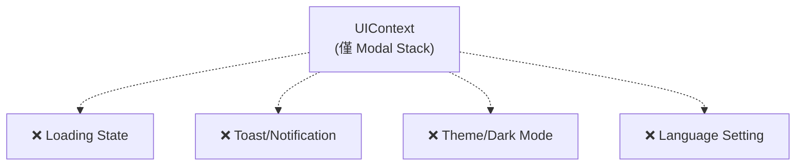
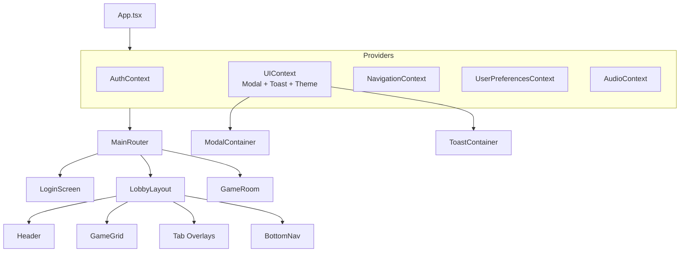

# 專案架構優化分析報告

> **專案名稱**：Casino Lobby Prototype  
> **分析日期**：2025-12-31  
> **版本**：v1.0

---

## 📋 分析範圍

本報告針對 Casino Lobby Prototype 專案進行架構評估，重點分析以下核心檔案：

| 檔案 | 行數 | 說明 |
|------|------|------|
| `src/App.tsx` | 352 | 主應用程式入口 |
| `src/context/UIContext.tsx` | 52 | UI 狀態管理（Modal Stack） |
| `src/components/ModalContainer.tsx` | 65 | Modal 統一渲染容器 |
| `src/context/AuthContext.tsx` | 77 | 用戶認證狀態 |
| `src/context/AudioContext.tsx` | 105 | 音效系統 |

---

## 1. 目前的潛在問題

### 1.1 `App.tsx` 過度膨脹（God Component 問題）

**現況分析：**

- 單一檔案 **352 行**，承擔過多職責
- `CasinoLandscape` 元件包含：Header、Navigation、Main Content、背景、Ticker、Overlays...
- 大量 local state 殘留（即使已註解），增加維護困難度

```tsx
// App.tsx 目前的職責混雜
const [activeTab, setActiveTab] = useState<ActiveTab>('games');
const [chatInitialTab, setChatInitialTab] = useState<...>('chat');
const [isSettingsOpen, setSettingsOpen] = useState(false);
const [isUserModalOpen, setUserModalOpen] = useState(false);
const [isLangModalOpen, setLangModalOpen] = useState(false);
```

> ⚠️ **警告**：當新增更多功能（多語系切換、使用者設定同步等），這些 state 會急速膨脹，難以追蹤資料流向。

---

### 1.2 `UIContext` 功能過於單一

**現況分析：**

- 僅管理 Modal Stack，缺乏其他全域 UI 狀態
- 未來需要的功能（Loading、Toast、Theme）沒有統一位置



---

### 1.3 Modal 與 Tab Overlay 管理分裂

**現況分析：**

- **全域 Modal**（透過 `UIContext` + `ModalContainer`）：`TransferModal`、`SaleModal` 等
- **Tab Overlay**（透過 `activeTab` local state）：`ChatInterface`、`EventsInterface` 等

這導致兩套不同的「頁面切換」邏輯並存：

| 類型 | 控制方式 | 關閉邏輯 |
|------|----------|----------|
| Modal | `openModal('type')` / `closeModal()` | Stack-based |
| Tab Overlay | `setActiveTab('games')` | Replace-based |

> ⛔ **注意**：如果 Tab Overlay 內需要開啟其他 Modal，兩者的 z-index 與關閉順序可能衝突。

---

### 1.4 缺乏 Router 概念

**現況分析：**

- 所有「畫面切換」都是透過 state 控制的條件渲染
- 無法使用瀏覽器的 Back Button
- 無法分享特定畫面的 URL（Deep Link）

---

### 1.5 使用者資料模型過於簡化

**現況分析：**

- `AuthContext.User` 僅包含基本欄位
- 未區分「登入類型」、「偏好設定」、「語言」等

```tsx
// 目前的 User 模型
interface User {
    name: string;
    avatar: string;
    vipLevel: number;
    balance: number;
    id: string;
}
```

未來需要：`loginType`、`language`、`preferences`、`permissions` 等。

---

### 1.6 Mock Data 與 Types 共存於單一檔案

**現況分析：**

- `mockData.tsx` 包含 **10+ 個 interface** 與對應的 mock arrays
- 當資料結構擴展，檔案會難以管理

---

## 2. 預計調整方案

### 2.1 目錄結構重組

```
src/
├── components/
│   ├── common/           # 通用 UI 元件
│   │   ├── Button/
│   │   ├── Modal/
│   │   └── Toast/
│   ├── layout/           # 版面元件
│   │   ├── Header.tsx
│   │   ├── Navigation.tsx
│   │   └── Ticker.tsx
│   ├── features/         # 功能模組
│   │   ├── auth/
│   │   ├── bank/
│   │   ├── chat/
│   │   ├── club/
│   │   └── games/
│   └── modals/           # 所有 Modal 集中
│       ├── PaymentModal.tsx
│       ├── TransferModal.tsx
│       └── ...
├── context/
│   ├── AuthContext.tsx
│   ├── UIContext.tsx     # 擴展：Loading, Toast, Theme
│   ├── UserContext.tsx   # 新增：使用者偏好
│   └── NavigationContext.tsx  # 新增：Tab/View 管理
├── hooks/
│   ├── useAudioSystem.ts
│   ├── useNavigation.ts  # 新增
│   └── useToast.ts       # 新增
├── types/                # 新增：獨立型別定義
│   ├── game.ts
│   ├── user.ts
│   └── transaction.ts
├── data/                 # 僅保留 mock data
│   └── mockData.ts
└── App.tsx               # 精簡後的入口
```

---

### 2.2 新增 Context 與 Hook

#### 2.2.1 `NavigationContext` — 統一畫面切換

```tsx
// 預計架構
interface NavigationContextType {
    currentView: ViewType;
    viewHistory: ViewType[];
    navigate: (view: ViewType, options?: { replace?: boolean }) => void;
    goBack: () => void;
}

type ViewType = 
    | { type: 'lobby' }
    | { type: 'game'; game: Game }
    | { type: 'tab'; tab: TabType }
    | { type: 'modal'; modal: ModalType; props?: any };
```

**優點：**

- 統一管理 Tab Overlay 與 Modal
- 可實作「返回上一頁」邏輯
- 未來可對接 React Router

---

#### 2.2.2 擴展 `UIContext` — 全域 UI 狀態

```tsx
interface UIContextType {
    // 現有
    modalStack: ModalItem[];
    openModal: (type: ModalType, props?: any) => void;
    closeModal: () => void;
    closeAll: () => void;
    
    // 新增
    isLoading: boolean;
    setLoading: (loading: boolean) => void;
    
    toasts: Toast[];
    showToast: (toast: Omit<Toast, 'id'>) => void;
    dismissToast: (id: string) => void;
    
    theme: 'dark' | 'light';
    setTheme: (theme: 'dark' | 'light') => void;
}
```

---

#### 2.2.3 `UserPreferencesContext` — 使用者偏好與設定

```tsx
interface UserPreferencesContextType {
    language: 'zh-TW' | 'zh-CN' | 'en' | 'ja';
    setLanguage: (lang: Language) => void;
    
    soundEnabled: boolean;
    musicEnabled: boolean;
    
    notifications: {
        push: boolean;
        email: boolean;
    };
}
```

**與 `AuthContext` 區分：**

- `AuthContext` → 認證狀態（登入/登出/Token）
- `UserPreferencesContext` → 使用者可調整的設定

---

### 2.3 拆解 `App.tsx`

| 抽出元件 | 職責 |
|----------|------|
| `LobbyLayout.tsx` | 整體 Lobby 版面（Header + Content + Nav） |
| `Header.tsx` | 頂部區域（User Info、Currency、Menu） |
| `BottomNavigation.tsx` | 底部導航列 |
| `NotificationTicker.tsx` | 跑馬燈公告 |
| `LobbyButtons.tsx` | 浮動按鈕（豬幫出動、首儲好禮） |
| `GameGrid.tsx` | 遊戲卡片排列區 |

**預計 `App.tsx` 精簡後：**

```tsx
function App() {
    return (
        <Providers>
            <ScaleContainer>
                <BrandLoading />  {/* 條件渲染 */}
                <MainRouter />
                <ModalContainer />
                <ToastContainer />
            </ScaleContainer>
        </Providers>
    );
}
```

---

### 2.4 Type 定義獨立化

將 `mockData.tsx` 中的 interface 移至 `src/types/`：

```
src/types/
├── index.ts          # Re-export all
├── game.ts           # Game, GameCategory
├── user.ts           # User, Friend, OnlinePlayer
├── chat.ts           # ChatMessage, ChatRoom
├── transaction.ts    # Package, SalePackage, Transaction
├── event.ts          # EventItem, GiftItem
└── inbox.ts          # InboxMessage
```

---

## 3. 調整後的預期架構

### 3.1 架構圖



---

### 3.2 擴充性評估表

| 未來功能 | 對應的架構支援 |
|----------|----------------|
| **多語系（i18n）** | `UserPreferencesContext.language` + i18n library |
| **更多遊戲層級** | `NavigationContext` + 專屬 Route |
| **使用者資訊管理** | `AuthContext` 擴展 + `UserPreferencesContext` |
| **深色/淺色主題** | `UIContext.theme` |
| **全域 Loading** | `UIContext.isLoading` |
| **Toast 通知** | `UIContext.toasts` + `ToastContainer` |
| **Push Notification** | `UserPreferencesContext.notifications` |

---

## 4. 分階段實作計畫

### Phase 1：目錄重組 + Type 獨立

**目標**：建立清晰的專案結構

**執行步驟：**

1. 建立 `src/types/` 目錄
2. 將 `mockData.tsx` 中的所有 interface 移至對應的 type 檔案
3. 建立 `src/types/index.ts` 統一匯出
4. 更新 `mockData.ts`（移除 interface，改為 import）
5. 建立 `src/components/layout/`、`src/components/common/`、`src/components/modals/` 目錄
6. 執行 `npm run build` 驗證

---

### Phase 2：拆解 `App.tsx` 為 Layout 元件

**目標**：降低 `App.tsx` 複雜度

**執行步驟：**

1. 建立 `src/components/layout/Header.tsx`
2. 建立 `src/components/layout/BottomNavigation.tsx`
3. 建立 `src/components/layout/NotificationTicker.tsx`
4. 建立 `src/components/layout/LobbyButtons.tsx`
5. 建立 `src/components/layout/GameGrid.tsx`
6. 建立 `src/components/layout/LobbyLayout.tsx`（整合以上元件）
7. 更新 `App.tsx`，使用新的 Layout 元件
8. 執行 `npm run build` 驗證

---

### Phase 3：實作 `NavigationContext`

**目標**：統一 Tab 與 View 的切換邏輯

**執行步驟：**

1. 建立 `src/context/NavigationContext.tsx`
2. 定義 `ViewType` 與 `NavigationContextType`
3. 實作 `navigate()`、`goBack()` 方法
4. 建立 `src/hooks/useNavigation.ts`
5. 將 `LobbyLayout` 中的 `activeTab` 遷移至 `NavigationContext`
6. 更新所有使用 `setActiveTab` 的元件
7. 執行 `npm run build` 驗證

---

### Phase 4：擴展 `UIContext`（Toast、Loading）

**目標**：提供全域 UI 狀態管理

**執行步驟：**

1. 在 `UIContext.tsx` 新增 `isLoading`、`setLoading`
2. 新增 `Toast` 介面與 `toasts` 陣列
3. 實作 `showToast()`、`dismissToast()`
4. 建立 `src/components/common/ToastContainer.tsx`
5. 在 `App.tsx` 加入 `<ToastContainer />`
6. 建立 `src/hooks/useToast.ts`
7. 執行 `npm run build` 驗證

---

### Phase 5：實作 `UserPreferencesContext`

**目標**：管理使用者可調整的偏好設定

**執行步驟：**

1. 建立 `src/context/UserPreferencesContext.tsx`
2. 定義 `UserPreferencesContextType`
3. 實作語言切換 `setLanguage()`
4. 整合現有的 `AudioContext` 設定（或保持獨立）
5. 更新 `SettingsMenu` 使用新的 Context
6. 將 `LanguageModal` 連接至 `UserPreferencesContext`
7. 執行 `npm run build` 驗證

---

## 附錄：檔案清單變更預覽

### 新增檔案

| 路徑 | 說明 |
|------|------|
| `src/types/index.ts` | Type 統一匯出 |
| `src/types/game.ts` | Game 相關型別 |
| `src/types/user.ts` | User 相關型別 |
| `src/types/chat.ts` | Chat 相關型別 |
| `src/types/transaction.ts` | Transaction 相關型別 |
| `src/types/event.ts` | Event 相關型別 |
| `src/types/inbox.ts` | Inbox 相關型別 |
| `src/context/NavigationContext.tsx` | 導航狀態管理 |
| `src/context/UserPreferencesContext.tsx` | 使用者偏好管理 |
| `src/components/layout/Header.tsx` | Header 元件 |
| `src/components/layout/BottomNavigation.tsx` | 底部導航 |
| `src/components/layout/NotificationTicker.tsx` | 跑馬燈 |
| `src/components/layout/LobbyButtons.tsx` | 浮動按鈕 |
| `src/components/layout/GameGrid.tsx` | 遊戲卡片區 |
| `src/components/layout/LobbyLayout.tsx` | Lobby 整體版面 |
| `src/components/common/ToastContainer.tsx` | Toast 容器 |
| `src/hooks/useNavigation.ts` | Navigation Hook |
| `src/hooks/useToast.ts` | Toast Hook |

### 修改檔案

| 路徑 | 變更內容 |
|------|----------|
| `src/App.tsx` | 精簡為入口，使用 Layout 元件 |
| `src/context/UIContext.tsx` | 擴展 Loading、Toast、Theme |
| `src/data/mockData.ts` | 移除 interface，改為 import |

---

> 📌 **本報告僅供分析參考，實際實作前請確認各 Phase 的優先順序與時程。**
