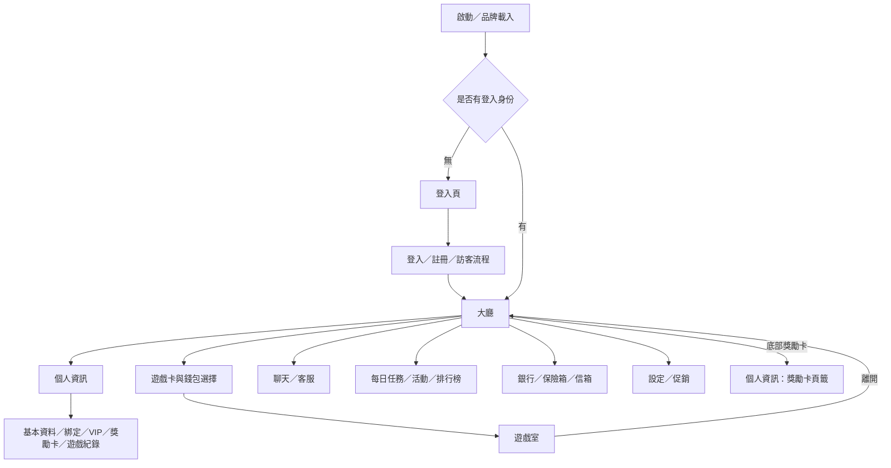

# 02. 整體介面架構與共用規則

巨亨ONLINE APP｜v0.10 分冊整理版｜2026-09-09

[返回總綱](../APP_FRONTEND_SPEC.md#ch-02) · [撰寫規則](../spec-guidelines/APP_SPEC_RULES.md)

| 文件項目 | 內容 |
|---|---|
| 文件性質 | 基礎說明文件；本批完成文件重整，操作驗收未執行 |
| 與現有文件關係 | 承接總規格第 02 章；總綱保留索引，本文件為該章正文維護來源 |
| 本版目的 | 獨立查閱並保留既有規則、來源與跨章關係 |
| 適用範圍 | 入口、身份、幣別、三種碼、回饋、保存與時間 |
| 不在本版範圍 | 各功能完整流程與正式 API 契約 |
| 上游依據 | 總規格既有正文、已確認 APP 分冊規則；原型連結見總綱首頁 |

## 目錄

| 小節 | 內容 | 主要讀者 |
|---|---|---|
| 1 | [整體入口地圖](#section-01) | 全體 |
| 2 | [主入口、預設內容與交接](#section-02) | 全體 |
| 3 | [身份與頁面層級名詞](#section-03) | 全體 |
| 4 | [幣別與資產位置](#section-04) | 全體 |
| 5 | [三種碼的名稱與關係](#section-05) | 全體 |
| 6 | [共用回饋與返回語意](#section-06) | 全體 |
| 7 | [保存與時間基準](#section-07) | 全體 |
| 8 | [可追查依據](#section-08) | 全體 |
| 9 | [共用驗收對照](#section-09) | QA、前後端 |
| 10 | [待確認事項](#section-10) | 產品、後端 |
| 11 | [版本沿革與交付檢查](#section-11) | 維護者 |

## 1. 整體入口地圖

圖中箭頭表示可追查的功能入口；付款與第三方授權仍是原型流程，不能把此圖解讀成正式服務完成證據。

## 2. 主入口、預設內容與交接

| 來源／操作 | 開啟位置 | 預設內容／帶入資訊 | 關閉或完成後 |
|---|---|---|---|
| 啟動載入完成 | 登入頁或大廳 | 無身份進登入；保存的身份可進大廳 | 不額外插入未接入的年齡提示 |
| 大廳玩家頭像／摘要 | 個人資訊 | 基本資料頁籤，共用摘要持續顯示 | 關閉個人資訊；一般大廳入口回大廳，其他底層已開功能依現況保留 |
| 底部獎勵卡 | 個人資訊的獎勵卡頁籤 | 直接選中獎勵卡頁籤 | 關閉後回大廳 |
| 底部聊天／客服 | 聊天與客服 | 分別開私人聊天／客服 | 關閉整個介面回大廳 |
| 底部每日任務／活動 | 任務與活動 | 分別開每日任務／活動 | 關閉整個介面回大廳 |
| 底部銀行 | 銀行 | 儲值 | 關閉回大廳 |
| 頂部 BUY／錢包餘額 | 銀行 | 使用導航保存的銀行初始頁籤，初值為儲值；不等於一律強制儲值 | 關閉回大廳 |
| 底部保險箱 | 保險箱 | 保險箱頁籤、預設存入模式 | 關閉回大廳 |
| 底部信箱 | 信箱 | 營運公告，預設選擇首筆符合分類的信件 | 關閉回大廳 |
| SALE／大廳促銷圖示 | 促銷彈窗 | 依入口帶入輪播起始索引 | 關閉最上層促銷彈窗 |
| 銀行儲值方案／促銷購買 | 支付彈窗 | 帶入方案內容、App Store 預設通路 | 關閉返回底層銀行或促銷；處理中關閉停用 |
| 銀行優惠 | 銀行優惠頁 | 優惠碼輸入；不是原優惠購買卡片 | 切頁或關閉銀行 |
| 優惠碼預覽成功 | 優惠碼確認領取彈窗 | 代碼、商品、數量、可兌換與使用期限 | 取消不領取；確認後回優惠頁顯示結果 |
| 玩家卡私訊／贈禮／檢舉 | 聊天／客服或保險箱贈禮 | 帶入聊天對象、贈禮接收者 ID，或客服檢舉對象與標題 | 先關閉玩家卡，再開目標功能 |
| 獎勵卡空畫面「前往每日任務」 | 每日任務頁 | 每日任務 | 關閉個人資訊後切換 |
| 活動銀幣 Mock 流水完成 | 活動銀幣轉換結果彈窗 | 轉換與回收結果、銀幣錢包餘額 | 確認／關閉留在原畫面；查看紀錄則離開遊戲並開銀行紀錄 |
| 設定的語言／規章／黑名單 | 語言／規章／黑名單 | 各自功能；規章預設使用者規章 | 先收起設定，關閉彈窗不自動重開設定 |
| 設定登出 | 登入頁 | 清除目前保存的 Mock 身份 | 不宣稱所有共用記憶體資料也已清除，見 [02.7](02-shared-rules.md#legacy-02-7) |

## 3. 身份與頁面層級名詞

| 統一名稱 | 意義與邊界 |
|---|---|
| 未登入 | 目前沒有登入身份，主內容顯示登入頁。 |
| 訪客 | 以訪客登入建立的 Mock 身份，可進大廳；目前為 VIP0、無個人邀請碼、不可兌換優惠碼，也不顯示自動傳送設定入口。其他功能限制須逐項描述，不能概括成訪客只能瀏覽。 |
| 一般會員 | 本版非訪客登入來源的會員身份；目前種子 VIP6 是示範值，不是所有正式會員的初始等級。 |
| 帳號／會員 ID／暱稱 | 帳號是登入識別文字，ID 是玩家識別，暱稱是顯示名稱。三者不得互相替代；傳入玩家對象時保留 ID。 |
| 帳號綁定 | 與目前身份建立手機或 Google 綁定狀態；綁定不自行把訪客升級成一般會員，也不證明身份合併已完成。 |
| 個人資訊 | 查看自己的五頁籤功能；與聊天中查看他人的「玩家資訊卡」分開。 |
| 頁籤 | 同一功能內的內容分類；不是新的登入身份或獨立服務。 |
| 功能介面／彈窗 | 大廳之上的功能內容或確認／選擇視窗；關閉方式依來源與層級描述。 |
| 金融紀錄／遊戲紀錄 | 前者記錄資產相關事件，後者查詢遊戲投注與結果；兩者不是同一列表，也不應假設每個餘額動作目前都會產生金融紀錄。 |
| 目前 VIP／歷史最高 VIP | 生效等級與曾達最高等級分開；歷史最高不得代替目前權益或領獎資格。 |
| 活躍指數／保級活躍天數 | 活躍指數目前固定為 0 的預留欄位；與保級天數不同，不互相映射。 |

## 4. 幣別與資產位置

| 統一名稱 | 顯示別名 | 資產位置／用途 | 本版區別 |
|---|---|---|---|
| 金幣 | 部分說明稱儲值金幣 | 一般錢包；支援遊戲、保險箱存取與金銀幣兌換 | 是幣別名稱，不由「儲值」字樣推斷每筆金幣都來自付費。 |
| 銀幣 | 儲值銀幣 | 一般錢包；支援遊戲、補簽、兌換與獎勵入帳 | 優惠碼或卡片轉換所得銀幣也進此錢包，不因此增加付費儲值指標。 |
| 銅幣 | 無 | 一般錢包；支援遊戲及指定獎勵 | 不等於活動銀，不納入保險箱金幣。 |
| 活動銀幣 | 活動銀 | 有效獎勵卡的活動額度 | 使用前須啟用；轉換後才進銀幣錢包。 |
| 活動金幣 | 活動金 | 目前優惠碼發放的獨立活動額度 | 僅入帳與顯示，不提供遊戲選擇、卡片或流水轉換。 |
| 保險箱金幣 | 保險箱餘額 | 從錢包存入的金幣，供取出或贈禮 | 與錢包金幣分開計算，不是第六種幣別。 |

| 額度名詞 | 計算／呈現意義 |
|---|---|
| 錢包餘額 | 金、銀、銅分別顯示；不可將三種數字相加作單一可用餘額。 |
| 活動銀幣總額／卡片餘額 | 有效的未啟用、使用中及已停用卡片目前餘額加總；不計已合併來源或已轉換卡。 |
| 目前可用活動銀幣 | 僅有效的使用中卡片餘額；可能低於卡片總額。 |
| 起始餘額紀錄 | 卡片初始金額紀錄，舊規格亦稱卡片總金額；不等於玩家目前可用額度。 |
| 流水／目標流水 | 已累積的有效使用量與達成條件；不等於餘額。原型以 Mock 按鈕完成，不證明逐局累積。 |
| 轉換上限／轉換額度／回收額度 | 上限是可轉換的最大額度；實際轉換取卡片目前餘額與上限的較小值；超出部分為回收額度。 |

頂部顯示金銀銅；個人資訊摘要另顯示活動金、活動銀；獎勵卡概覽再顯示目前可用活動銀。遊戲選擇提供金、銀、活動銀、銅四類，且須同時符合遊戲支援與餘額可用條件。金銀幣兌換、費率、各獎勵數值見第 06～10 章，本章不新增數值決策。

## 5. 三種碼的名稱與關係

| 統一名稱 | 所在介面／來源 | 格式與目前用途 | 保存／目前未提供的能力 |
|---|---|---|---|
| 個人邀請碼 | 自己的個人資訊摘要；一般會員 Mock 身份建立時提供 | 8 碼大寫英數，排除 I、O、0、1；顯示與複製 | 隨身份保存，刷新不變；登出再登入可能重建，不保證正式跨玩家唯一性或永久不變。 |
| 銀行優惠碼 | 銀行優惠頁；營運提供的示範碼 | 8 碼英數，忽略前後空白及大小寫；預覽後確認領取指定商品 | 同來源＋精確帳號字串同碼一次，本機記憶體保存；不提供後台產碼、推薦關係或跨裝置防重複保證。 |
| 註冊推廣碼 | 註冊表單選填欄位 | 6 或 8 碼大寫英數；畫面提示代理 6 碼／玩家 8 碼 | 目前檢查格式，提交登入未傳遞此欄位以建立關係；不可宣稱已驗證邀請人或發放推薦回饋。 |

**已確認區別：**優惠碼與個人邀請碼是不同用途，不可因皆為八碼而互相使用。註冊推廣碼目前僅檢查格式，尚未建立推薦關係；後續若調整此流程，於註冊與個人資訊章節同步記錄。

## 6. 共用回饋與返回語意

- 本文件以實際關閉按鈕與操作入口描述返回，不預設手機系統返回鍵或瀏覽器上一頁等同功能返回。
- 聊天、活動、銀行、保險箱、信箱的主關閉回大廳。子頁籤切換不等於主視窗關閉；需要帶入對象的跳轉在 [02.2](02-shared-rules.md#legacy-02-2) 列明。
- 共用大廳彈窗預設不以背景點擊關閉。活動詳情、獎勵轉換結果等有個別背景關閉行為，依各功能章節說明；不可一律套用。
- 目前未見全域 ESC 關閉彈窗機制。分類側欄具有 ESC 返回子分類／收合行為，不能外推到其他彈窗。
- 支付處理中關閉停用；其他流程的處理中、成功、失敗與可取消時機，由各功能章節逐項列出，不強制所有功能使用相同狀態數。
- Toast 是短暫的成功、錯誤或資訊回饋，不是金融紀錄或正式服務憑證；全域 Toast 與聊天局部提示不視為同一保存資料。
- 選取預覽、提交確認與領取成功要分開。優惠碼取消不消耗資格；獎勵卡合併取消不改卡片。已確認的 VIP 領獎按鈕維持其既有狀態，不額外增加等待態。
- 查無資料與操作失敗不同：空清單可提供引導，失敗須保留原因；尚無失敗設計的服務列待確認，不自行發明重試或補償規則。

## 7. 保存與時間基準

以下描述本機原型，不作為正式後端保存契約。

| 資料 | 切頁／關閉重開 | 重新整理 | 登出／換帳號注意事項 |
|---|---|---|---|
| 身份、個人資料、綁定與邀請碼 | 共用身份保存 | 保留本機身份資料 | 登出清除身份，重新登入建立 Mock 使用者；不是完整帳號資料庫。 |
| 金銀銅、保險箱、VIP 指標／領獎與金融紀錄 | 共用狀態保留 | 回到種子值／紀錄 | 登入重建使用者，金融紀錄未見相同清除邏輯；不得宣稱所有狀態同步隔離。 |
| 任務進度、卡片、合併來源與轉換通知 | 共用狀態保留 | 恢復示範預設 | 目前未依帳號分區。 |
| 優惠碼資格與活動金 | 按登入來源＋帳號保留 | 重置 | 同頁面生命週期可保留不同身份的領取集合，不等於其餘錢包也如此保存。 |
| 聊天訊息、草稿與自動發送設定 | 同視窗切頻道保留；主關閉、跨功能或重新建立指定對話入口時重建 | 初始化 | 不作為正式聊天歷史或排程；好友關係另列。 |
| 信箱內容、已讀、刪除與已領附件 | 同視窗保留；主關閉再開回種子，已加的當次金幣仍保留 | 初始化 | 原型可重領缺口見 12.4；不作正式附件核銷規則。 |
| 好友與黑名單 | 共用狀態保留 | 初始化 | 未見帳號分區／登出清除；正式隔離要求待補。 |
| 語言、日夜、音樂與音效偏好、我的最愛、最近點擊遊戲 | 保存本機偏好／收藏 | 可還原本機值 | 不是按會員分區；登出不代表偏好清空。 |
| 推播開關 | 設定選單存續期間保留 | 重置 | 重開設定會初始化；沒有真實推播服務。 |

優惠碼兌換期限以含時區的資料判斷，畫面標示台北時間；卡片到期以卡片標示日期的翌日 00:00（瀏覽器當地時區）判斷；任務日曆使用本機日期。這是目前原型的時間處理方式，尚不代表已確認正式統一時區。卡片剩餘時間必須超過 72 小時才可合併是已有確認規則，不因時區議題重開該門檻決策。

## 8. 可追查依據

產品閱讀可略過本節；設計、開發與測試核對時使用以下來源：

- 啟動與入口：[App](../../src/App.tsx)、[大廳](../../src/components/layout/LobbyLayout.tsx)、[底部導航](../../src/components/layout/BottomNavigation.tsx)、[頂部資訊](../../src/components/layout/Header.tsx)、[導航狀態](../../src/context/NavigationContext.tsx)。
- 資產與三種碼：[身份與錢包](../../src/context/AuthContext.tsx)、[活動額度](../../src/hooks/useActivityBalances.ts)、[遊戲錢包](../../src/utils/gameWallets.ts)、[邀請碼](../../src/utils/invitationCode.ts)、[優惠碼資料](../../src/data/promoCodes.ts)、[優惠碼領取](../../src/context/PromoCodeContext.tsx)、[註冊提交](../../src/components/modals/SignupModal.tsx)。
- 保存與回饋：[獎勵卡](../../src/context/RewardCardContext.tsx)、[活動](../../src/context/ActivityContext.tsx)、[社交](../../src/context/SocialContext.tsx)、[偏好](../../src/context/UserPreferencesContext.tsx)、[彈窗外框](../../src/components/common/LobbyModalShell.tsx)、[全域彈窗](../../src/components/ModalContainer.tsx)、[UI 提示](../../src/context/UIContext.tsx)。

## 9. 共用驗收對照

本節引用既有驗收，不另建立重複 AC；結果仍記錄在總綱第 14 章。

| 共用規則 | 具體驗證方向 | 既有 AC |
|---|---|---|
| 身份與入口 | 頂部摘要與底部獎勵卡開啟同一外框、不同頁籤 | AC-06-001 |
| 活動額度 | 有總額但未啟用時，不能以活動銀進遊戲 | AC-07-012 |
| 資料保存 | 刷新後身份保存與 VIP 領取重置分開判讀 | AC-06-016 |
| 三種碼 | 一般會員複製八碼邀請碼；銀行優惠碼仍使用獨立兌換流程 | AC-06-008、AC-08-009 |
| 關閉與返回 | 轉換結果確認留遊戲，查看紀錄則進銀行 | AC-05-007 |

## 10. 待確認事項

| 類別 | 編號 | 問題 | 影響／等待對象 | 狀態 |
|---|---|---|---|---|
| 待產品決策 | Q-02-001 | 正式系統採用何種統一時間與日期顯示基準？ | 任務、卡片、優惠碼；不重開 72 小時合併門檻 | 未決 |
| 待外部輸入 | Q-02-002 | 正式服務如何提供帳號隔離、持久化與跨裝置一致性？ | 後端；各功能已確認的保存需求與服務契約 | 待服務設計 |

本表承接第 7 節現有限制。各功能的特定流程與未決項目仍由其文件負責。

## 11. 版本沿革與交付檢查

| 版本 | 日期 | 內容 |
|---|---|---|
| v0.7 來源 | 2026-09-09 | 原總規格既有第 02 章；歷史變更見總綱 |
| v0.10 | 2026-09-09 | 獨立整理本章，保留原規則；補充結構與文件連結 |

| 檢查面 | 完成條件 | 狀態 |
|---|---|---|
| 內容 | 原章節全部段落有承接位置 | 已逐節移入 |
| 格式與連結 | Markdown／HTML 內容一致、連結及錨點有效 | 由文件檢查核對 |
| 驗收 | 有瀏覽器與正式服務執行證據 | 未執行，不以文件完成替代 |
